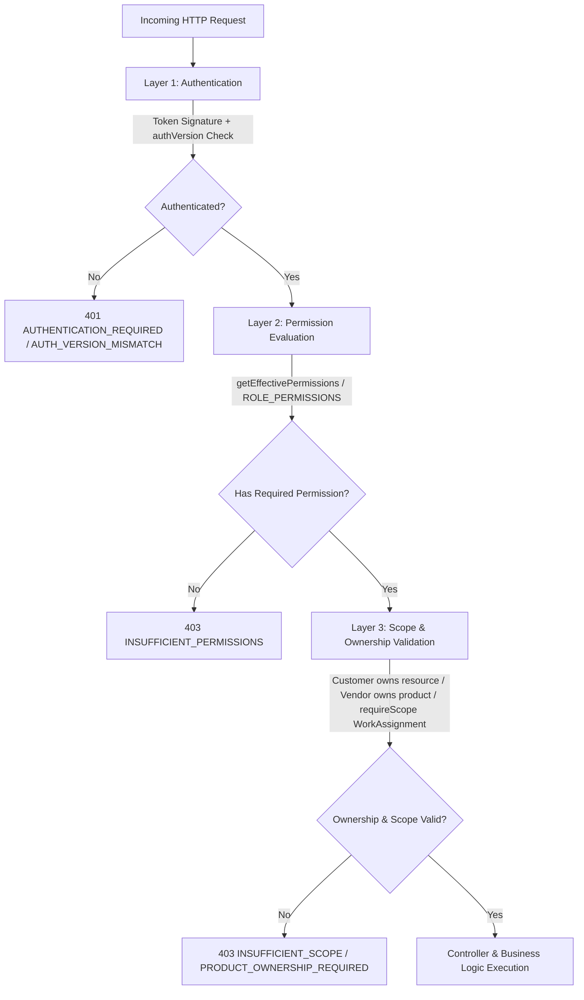

# Buybox Authorization Route Matrix & Migration Readiness Audit (Phase 1G)

## Document Metadata
- **Status:** APPROVED READINESS AUDIT & CANONICAL ROUTE MATRIX (RECONCILED)
- **Target Location:** `docs/security/authorization-route-matrix.md`
- **Preceding Phases:** 
  - Phase 1C: Effective Permission Resolver + Versioned Authorization
  - Phase 1D: Batch 1 Dynamic Authorization
  - Phase 1E: WorkAssignment Scope Authorization Foundation
  - Phase 1F: Super Admin RBAC/PBAC Governance Backend
- **Phase Objective:** Complete backend route audit, three-layer authorization mapping, anomaly detection, scope readiness analysis, and test plan preparation. **No production route migration performed in this phase.**

---

## 1. Executive Summary & Inventory Overview

A comprehensive audit of the entire Buybox Express application tree discovered **262 production API endpoints** across 40 router modules, `app.js`, and `routes/index.js`.

### Route Classification Summary

| Category Code | Classification Name | Description | Endpoint Count | Percentage |
| :--- | :--- | :--- | :--- | :--- |
| **A** | **Already Dynamic** | Operational routes verified and dynamically enforced in Phase 1D (Batch 1) | **17** | 6.5% |
| **B** | **Safe Next Migration** | All 82 endpoints migrated & verified across Batches 2A–2G (Batch 2 Complete) | **82** (82 Migrated / 0 Pending) | 31.3% |
| **C** | **Permission + Ownership** | Vendor self-service / mutations requiring dynamic permissions preserving resource ownership | **19** | 7.3% |
| **D** | **Permission + Scope** | Platform actor routes requiring WorkAssignment `requireScope()` enforcement (Completed across Phases A–D) | **20** (20 Enforced / 0 Pending) | 7.6% |
| **E** | **Complex / Deferred** | Double-entry finance ledger, settlements, payouts, stock adjustments, refunds | **22** | 8.4% |
| **F** | **Public / Customer** | Public storefront/auth endpoints or customer self-service scoped to `req.user.id` | **73** | 27.9% |
| **G** | **Governance** | Super Admin RBAC/PBAC governance control plane verified in Phase 1F | **26** | 9.9% |
| **H** | **Unscoped Catalog** | Global Brand mutations requiring catalog permissions without scope dependency | **3** | 1.1% |
| **TOTAL** | | **All Indexed Production Endpoints** | **262** | **100.0%** |

> [!NOTE]
> **Batch 2 Mathematical Reconciliation (82 Endpoints):**
> The initial audit draft listed Category B as 82 endpoints while the preliminary narrative itemization summed to 80. Reconciliation confirmed that **55 Storefront Admin Operations** exist across 11 sub-routers (previously underreported as 53 in prose). 
> $$55 \text{ (Storefront)} + 6 \text{ (CMS)} + 3 \text{ (Tax)} + 4 \text{ (Coupons)} + 6 \text{ (Campaigns)} + 2 \text{ (Campaign Perf)} + 1 \text{ (Review Mod)} + 1 \text{ (Vendor List)} + 1 \text{ (Warehouse Create)} + 2 \text{ (Shipment Get)} + 1 \text{ (Coupon Redemp)} = \mathbf{82}$$
> No endpoints were omitted from the canonical matrix table.

---

## 2. Three-Layer Security Architecture

Every protected route in the Buybox architecture strictly decouples security concerns into three independent layers:



1. **Layer 1 — Authentication (`authenticate`):**
   - Verifies JWT bearer token signature and expiration.
   - Enforces session freshness via `authVersion` comparison between token and User document. Rejects invalidated tokens with `401 AUTH_VERSION_MISMATCH`.
   - Compares `permissionVersion`. Sets `req.user.isPermissionFresh = false` on version mismatch to force authoritative database resolution.
2. **Layer 2 — Permission Authorization (`requirePermissions`):**
   - Authorizes operation against `getEffectivePermissions(userId)`:
     $$\text{Effective Permissions} = (\text{Active Role Permissions} \cup \text{Active Direct Grants}) \setminus \text{Active Direct Restrictions}$$
   - Direct restrictions strictly override inherited role permissions and direct grants.
   - Status gate: Terminated or suspended employees receive zero privileged permissions.
   - Compatibility fallback: Customers and vendors without Employee profiles fall back strictly to static `ROLE_PERMISSIONS`.
3. **Layer 3 — Ownership / Scope / Domain Validation:**
   - **Customer Ownership:** Enforced via `req.user.id` matching `customerId` / `userId` on documents (cart, orders, addresses, reviews).
   - **Vendor Ownership:** Enforced via authenticated vendor profile resolution (`Vendor.findOne({ userId })`) matching `Product.vendorId` or `Shipment.vendorId`.
   - **Operational Scope (`requireScope`):** Evaluates whether an authenticated platform actor possesses active `WorkAssignment` records covering the target scope ID for scope types: `vendor`, `warehouse`, `category`, or `support_queue`.

---

## 3. Canonical Route Authorization Matrix

The table below lists every production route discovered in the backend.

| Method | Route | Actor | Permission | Scope | Ownership/Domain Check | Current Guard | Target Guard | Migration Batch |
| :--- | :--- | :--- | :--- | :--- | :--- | :--- | :--- | :--- |

### Domain: SYSTEM (2 endpoints)

| Method | Route | Actor | Permission | Scope | Ownership/Domain Check | Current Guard | Target Guard | Migration Batch |
| :--- | :--- | :--- | :--- | :--- | :--- | :--- | :--- | :--- |
| `GET` | `/health` | public | `none` | `none` | None (Public) | `None (Public)` | `None (Public)` | Public / Customer |
| `GET` | `/api/v1` | public | `none` | `none` | None (Public) | `None (Public)` | `None (Public)` | Public / Customer |

### Domain: AUTH (8 endpoints)

| Method | Route | Actor | Permission | Scope | Ownership/Domain Check | Current Guard | Target Guard | Migration Batch |
| :--- | :--- | :--- | :--- | :--- | :--- | :--- | :--- | :--- |
| `POST` | `/api/v1/auth/register` | public | `none` | `none` | None (Public) | `None (Public)` | `None (Public)` | Public / Customer |
| `POST` | `/api/v1/auth/login` | public | `none` | `none` | None (Public) | `None (Public)` | `None (Public)` | Public / Customer |
| `POST` | `/api/v1/auth/refresh` | public | `none` | `none` | None (Public) | `None (Public)` | `None (Public)` | Public / Customer |
| `POST` | `/api/v1/auth/logout` | public | `none` | `none` | None (Public) | `None (Public)` | `None (Public)` | Public / Customer |
| `GET` | `/api/v1/auth/verify-email` | public | `none` | `none` | None (Public) | `None (Public)` | `None (Public)` | Public / Customer |
| `POST` | `/api/v1/auth/forgot-password` | public | `none` | `none` | None (Public) | `None (Public)` | `None (Public)` | Public / Customer |
| `POST` | `/api/v1/auth/reset-password` | public | `none` | `none` | None (Public) | `None (Public)` | `None (Public)` | Public / Customer |
| `POST` | `/api/v1/auth/logout-all` | customer | `none` | `none` | User invalidates own authVersion | `authenticate` | `authenticate` | Public / Customer |

### Domain: CUSTOMERS (3 endpoints)

| Method | Route | Actor | Permission | Scope | Ownership/Domain Check | Current Guard | Target Guard | Migration Batch |
| :--- | :--- | :--- | :--- | :--- | :--- | :--- | :--- | :--- |
| `GET` | `/api/v1/customers/me` | customer | `none` | `none` | Customer owns resource via req.user.id | `authenticate` | `authenticate` | Public / Customer |
| `POST` | `/api/v1/customers/me` | customer | `none` | `none` | Customer owns resource via req.user.id | `authenticate` | `authenticate` | Public / Customer |
| `PATCH` | `/api/v1/customers/me` | customer | `none` | `none` | Customer owns resource via req.user.id | `authenticate` | `authenticate` | Public / Customer |

### Domain: ADDRESSES (5 endpoints)

| Method | Route | Actor | Permission | Scope | Ownership/Domain Check | Current Guard | Target Guard | Migration Batch |
| :--- | :--- | :--- | :--- | :--- | :--- | :--- | :--- | :--- |
| `GET` | `/api/v1/addresses` | customer | `none` | `none` | Customer owns resource via req.user.id | `authenticate` | `authenticate` | Public / Customer |
| `GET` | `/api/v1/addresses/:id` | customer | `none` | `none` | Customer owns resource via req.user.id | `authenticate` | `authenticate` | Public / Customer |
| `POST` | `/api/v1/addresses` | customer | `none` | `none` | Customer owns resource via req.user.id | `authenticate` | `authenticate` | Public / Customer |
| `PATCH` | `/api/v1/addresses/:id` | customer | `none` | `none` | Customer owns resource via req.user.id | `authenticate` | `authenticate` | Public / Customer |
| `DELETE` | `/api/v1/addresses/:id` | customer | `none` | `none` | Customer owns resource via req.user.id | `authenticate` | `authenticate` | Public / Customer |

### Domain: VENDORS (6 endpoints)

| Method | Route | Actor | Permission | Scope | Ownership/Domain Check | Current Guard | Target Guard | Migration Batch |
| :--- | :--- | :--- | :--- | :--- | :--- | :--- | :--- | :--- |
| `GET` | `/api/v1/vendors/me` | vendor | `none` | `vendor` | Vendor owns resource (product, shipment, or profile) | `authenticate + requireRoles(vendor)` | `authenticate + requireRoles(vendor) / requirePermissions(vendors:manage)` | Batch 3 (Ownership-Preserving) |
| `POST` | `/api/v1/vendors/me` | vendor | `none` | `vendor` | Vendor owns resource (product, shipment, or profile) | `authenticate + requireRoles(vendor)` | `authenticate + requireRoles(vendor) / requirePermissions(vendors:manage)` | Batch 3 (Ownership-Preserving) |
| `PATCH` | `/api/v1/vendors/me` | vendor | `none` | `vendor` | Vendor owns resource (product, shipment, or profile) | `authenticate + requireRoles(vendor)` | `authenticate + requireRoles(vendor) / requirePermissions(vendors:manage)` | Batch 3 (Ownership-Preserving) |
| `GET` | `/api/v1/vendors` | employee/platform actor | `vendors:read` | `none` | None (Platform Admin/Operational) | `authenticate + requirePermissions(vendors:read)` | `authenticate + requirePermissions(vendors:read)` | Batch 2F (Migrated & Verified) |
| `GET` | `/api/v1/vendors/:id` | employee/platform actor | `vendors:read` | `vendor` | Employee WorkAssignment scope check (vendor) | `authenticate + requirePermissions(vendors:read)` | `authenticate + requirePermissions(vendors:read) + requireScope(vendor)` | Batch 4 (Scope-Aware) |
| `PATCH` | `/api/v1/vendors/:id/status` | employee/platform actor | `vendors:manage` | `vendor` | Employee WorkAssignment scope check (vendor) | `authenticate + requirePermissions(vendors:manage)` | `authenticate + requirePermissions(vendors:manage) + requireScope(vendor)` | Batch 4 (Scope-Aware) |

### Domain: PRODUCTS (6 endpoints)

| Method | Route | Actor | Permission | Scope | Ownership/Domain Check | Current Guard | Target Guard | Migration Batch |
| :--- | :--- | :--- | :--- | :--- | :--- | :--- | :--- | :--- |
| `GET` | `/api/v1/products` | public | `none` | `none` | None (Public) | `None (Public)` | `None (Public)` | Public / Customer |
| `GET` | `/api/v1/products/slug/:slug` | public | `none` | `none` | None (Public) | `None (Public)` | `None (Public)` | Public / Customer |
| `GET` | `/api/v1/products/:id` | public | `none` | `none` | None (Public) | `None (Public)` | `None (Public)` | Public / Customer |
| `POST` | `/api/v1/products` | vendor | `products:create` | `vendor` | Vendor owns resource (product, shipment, or profile) | `authenticate + requirePermissions(products:create)` | `authenticate + requirePermissions(products:create)` | Batch 3 (Ownership-Preserving) |
| `DELETE` | `/api/v1/products/:id` | vendor | `products:delete` | `vendor` | Vendor owns resource (product, shipment, or profile) | `authenticate + requirePermissions(products:delete)` | `authenticate + requirePermissions(products:delete)` | Batch 3 (Ownership-Preserving) |
| `PATCH` | `/api/v1/products/:id` | vendor | `products:update` | `vendor` | Vendor owns resource (product, shipment, or profile) | `authenticate + requirePermissions(products:update)` | `authenticate + requirePermissions(products:update)` | Batch 3 (Ownership-Preserving) |

### Domain: PRODUCT VARIANTS (5 endpoints)

| Method | Route | Actor | Permission | Scope | Ownership/Domain Check | Current Guard | Target Guard | Migration Batch |
| :--- | :--- | :--- | :--- | :--- | :--- | :--- | :--- | :--- |
| `GET` | `/api/v1/product-variants/product/:productId` | vendor | `products:read` | `vendor` | Vendor owns resource (product, shipment, or profile) | `authenticate + requirePermissions(products:read)` | `authenticate + requirePermissions(products:read)` | Batch 3 (Ownership-Preserving) |
| `GET` | `/api/v1/product-variants/:id` | vendor | `products:read` | `vendor` | Vendor owns resource (product, shipment, or profile) | `authenticate + requirePermissions(products:read)` | `authenticate + requirePermissions(products:read)` | Batch 3 (Ownership-Preserving) |
| `POST` | `/api/v1/product-variants/product/:productId` | vendor | `products:create` | `vendor` | Vendor owns resource (product, shipment, or profile) | `authenticate + requirePermissions(products:create)` | `authenticate + requirePermissions(products:create)` | Batch 3 (Ownership-Preserving) |
| `PATCH` | `/api/v1/product-variants/:id` | vendor | `products:update` | `vendor` | Vendor owns resource (product, shipment, or profile) | `authenticate + requirePermissions(products:update)` | `authenticate + requirePermissions(products:update)` | Batch 3 (Ownership-Preserving) |
| `DELETE` | `/api/v1/product-variants/:id` | vendor | `products:delete` | `vendor` | Vendor owns resource (product, shipment, or profile) | `authenticate + requirePermissions(products:delete)` | `authenticate + requirePermissions(products:delete)` | Batch 3 (Ownership-Preserving) |

### Domain: CATEGORIES (5 endpoints)

| Method | Route | Actor | Permission | Scope | Ownership/Domain Check | Current Guard | Target Guard | Migration Batch |
| :--- | :--- | :--- | :--- | :--- | :--- | :--- | :--- | :--- |
| `GET` | `/api/v1/categories` | public | `none` | `none` | None (Public) | `None (Public)` | `None (Public)` | Public / Customer |
| `GET` | `/api/v1/categories/:id` | public | `none` | `none` | None (Public) | `None (Public)` | `None (Public)` | Public / Customer |
| `POST` | `/api/v1/categories` | employee/platform actor | `products:create` | `category` | Employee WorkAssignment scope check (category) | `authenticate + requirePermissions(products:create)` | `authenticate + requirePermissions(products:create) + requireScope(category)` | Batch 4 (Scope-Aware) |
| `PATCH` | `/api/v1/categories/:id` | employee/platform actor | `products:update` | `category` | Employee WorkAssignment scope check (category) | `authenticate + requirePermissions(products:update)` | `authenticate + requirePermissions(products:update) + requireScope(category)` | Batch 4 (Scope-Aware) |
| `DELETE` | `/api/v1/categories/:id` | employee/platform actor | `products:delete` | `category` | Employee WorkAssignment scope check (category) | `authenticate + requirePermissions(products:delete)` | `authenticate + requirePermissions(products:delete) + requireScope(category)` | Batch 4 (Scope-Aware) |

### Domain: BRANDS (5 endpoints)

| Method | Route | Actor | Permission | Scope | Ownership/Domain Check | Current Guard | Target Guard | Migration Batch |
| :--- | :--- | :--- | :--- | :--- | :--- | :--- | :--- | :--- |
| `GET` | `/api/v1/brands` | public | `none` | `none` | None (Public) | `None (Public)` | `None (Public)` | Public / Customer |
| `GET` | `/api/v1/brands/:id` | public | `none` | `none` | None (Public) | `None (Public)` | `None (Public)` | Public / Customer |
| `POST` | `/api/v1/brands` | employee/platform actor | `products:create` | `none` | None (Global Catalog Operations) | `authenticate + requirePermissions(products:create)` | `authenticate + requirePermissions(products:create)` | Batch 4 / Unscoped Catalog |
| `PATCH` | `/api/v1/brands/:id` | employee/platform actor | `products:update` | `none` | None (Global Catalog Operations) | `authenticate + requirePermissions(products:update)` | `authenticate + requirePermissions(products:update)` | Batch 4 / Unscoped Catalog |
| `DELETE` | `/api/v1/brands/:id` | employee/platform actor | `products:delete` | `none` | None (Global Catalog Operations) | `authenticate + requirePermissions(products:delete)` | `authenticate + requirePermissions(products:delete)` | Batch 4 / Unscoped Catalog |

### Domain: CART (6 endpoints)

| Method | Route | Actor | Permission | Scope | Ownership/Domain Check | Current Guard | Target Guard | Migration Batch |
| :--- | :--- | :--- | :--- | :--- | :--- | :--- | :--- | :--- |
| `GET` | `/api/v1/cart` | customer | `none` | `none` | Customer owns resource via req.user.id | `authenticate` | `authenticate` | Public / Customer |
| `POST` | `/api/v1/cart/recover` | customer | `none` | `none` | Customer owns resource via req.user.id | `authenticate` | `authenticate` | Public / Customer |
| `POST` | `/api/v1/cart/items` | customer | `none` | `none` | Customer owns resource via req.user.id | `authenticate` | `authenticate` | Public / Customer |
| `PATCH` | `/api/v1/cart/items` | customer | `none` | `none` | Customer owns resource via req.user.id | `authenticate` | `authenticate` | Public / Customer |
| `DELETE` | `/api/v1/cart/items` | customer | `none` | `none` | Customer owns resource via req.user.id | `authenticate` | `authenticate` | Public / Customer |
| `DELETE` | `/api/v1/cart` | customer | `none` | `none` | Customer owns resource via req.user.id | `authenticate` | `authenticate` | Public / Customer |

### Domain: WISHLIST (4 endpoints)

| Method | Route | Actor | Permission | Scope | Ownership/Domain Check | Current Guard | Target Guard | Migration Batch |
| :--- | :--- | :--- | :--- | :--- | :--- | :--- | :--- | :--- |
| `GET` | `/api/v1/wishlist` | customer | `none` | `none` | Customer owns resource via req.user.id | `authenticate` | `authenticate` | Public / Customer |
| `POST` | `/api/v1/wishlist/items` | customer | `none` | `none` | Customer owns resource via req.user.id | `authenticate` | `authenticate` | Public / Customer |
| `DELETE` | `/api/v1/wishlist/items/:itemId` | customer | `none` | `none` | Customer owns resource via req.user.id | `authenticate` | `authenticate` | Public / Customer |
| `DELETE` | `/api/v1/wishlist` | customer | `none` | `none` | Customer owns resource via req.user.id | `authenticate` | `authenticate` | Public / Customer |

### Domain: ORDERS (4 endpoints)

| Method | Route | Actor | Permission | Scope | Ownership/Domain Check | Current Guard | Target Guard | Migration Batch |
| :--- | :--- | :--- | :--- | :--- | :--- | :--- | :--- | :--- |
| `GET` | `/api/v1/orders` | customer | `none` | `none` | Customer owns resource via req.user.id | `authenticate` | `authenticate` | Public / Customer |
| `GET` | `/api/v1/orders/:id` | customer | `none` | `none` | Customer owns resource via req.user.id | `authenticate` | `authenticate` | Public / Customer |
| `POST` | `/api/v1/orders/:id/cancel` | customer | `none` | `none` | Customer owns resource via req.user.id | `authenticate` | `authenticate` | Public / Customer |
| `POST` | `/api/v1/orders` | customer | `none` | `none` | Customer owns resource via req.user.id | `authenticate` | `authenticate` | Public / Customer |

### Domain: PAYMENTS (5 endpoints)

| Method | Route | Actor | Permission | Scope | Ownership/Domain Check | Current Guard | Target Guard | Migration Batch |
| :--- | :--- | :--- | :--- | :--- | :--- | :--- | :--- | :--- |
| `POST` | `/api/v1/payments/webhooks/razorpay` | public | `none` | `none` | Razorpay HMAC-SHA256 signature verification | `Razorpay signature header validation` | `Razorpay signature header validation` | Public / Customer |
| `POST` | `/api/v1/payments/orders/:orderId` | customer | `none` | `none` | Customer owns resource via req.user.id | `authenticate` | `authenticate` | Public / Customer |
| `POST` | `/api/v1/payments/verify` | customer | `none` | `none` | Customer owns resource via req.user.id | `authenticate` | `authenticate` | Public / Customer |
| `POST` | `/api/v1/payments/orders/:orderId/capture` | customer | `none` | `none` | Customer owns resource via req.user.id | `authenticate` | `authenticate` | Public / Customer |
| `POST` | `/api/v1/payments/orders/:orderId/refunds` | employee/platform actor | `payments:manage` | `none` | Double-entry ledger & idempotency integrity | `authenticate + requirePermissions(payments:manage)` | `authenticate + requirePermissions(payments:manage) + financialAuditGuard` | Batch 5 (Complex Operations) |

### Domain: SHIPMENTS (13 endpoints)

| Method | Route | Actor | Permission | Scope | Ownership/Domain Check | Current Guard | Target Guard | Migration Batch |
| :--- | :--- | :--- | :--- | :--- | :--- | :--- | :--- | :--- |
| `GET` | `/api/v1/shipments/my` | customer | `none` | `none` | Customer owns resource via req.user.id | `authenticate` | `authenticate` | Public / Customer |
| `GET` | `/api/v1/shipments/my/:shipmentId` | customer | `none` | `none` | Customer owns resource via req.user.id | `authenticate` | `authenticate` | Public / Customer |
| `GET` | `/api/v1/shipments/tracking/:trackingNumber` | customer | `none` | `none` | Public tracking token/number verification | `authenticate` | `authenticate` | Public / Customer |
| `GET` | `/api/v1/shipments/vendor/my` | vendor | `shipments:read_own` | `vendor` | Vendor owns resource (product, shipment, or profile) | `authenticate + requirePermissions(shipments:read_own)` | `authenticate + requirePermissions(shipments:read_own)` | Batch 3 (Ownership-Preserving) |
| `GET` | `/api/v1/shipments/vendor/my/:shipmentId` | vendor | `shipments:read_own` | `vendor` | Vendor owns resource (product, shipment, or profile) | `authenticate + requirePermissions(shipments:read_own)` | `authenticate + requirePermissions(shipments:read_own)` | Batch 3 (Ownership-Preserving) |
| `POST` | `/api/v1/shipments/vendor` | vendor | `shipments:manage_own` | `vendor` | Vendor owns resource (product, shipment, or profile) | `authenticate + requirePermissions(shipments:manage_own)` | `authenticate + requirePermissions(shipments:manage_own)` | Batch 3 (Ownership-Preserving) |
| `PATCH` | `/api/v1/shipments/vendor/:shipmentId/status` | vendor | `shipments:manage_own` | `vendor` | Vendor owns resource (product, shipment, or profile) | `authenticate + requirePermissions(shipments:manage_own)` | `authenticate + requirePermissions(shipments:manage_own)` | Batch 3 (Ownership-Preserving) |
| `GET` | `/api/v1/shipments/:shipmentId` | employee/platform actor | `shipments:read` | `none` | None (Platform Admin/Operational) | `authenticate + requirePermissions(shipments:read)` | `authenticate + requirePermissions(shipments:read)` | Batch 2G (Migrated & Verified) |
| `GET` | `/api/v1/shipments/order/:orderId` | employee/platform actor | `shipments:read` | `none` | None (Platform Admin/Operational) | `authenticate + requirePermissions(shipments:read)` | `authenticate + requirePermissions(shipments:read)` | Batch 2G (Migrated & Verified) |
| `GET` | `/api/v1/shipments/vendor/:vendorId` | employee/platform actor | `shipments:read` | `vendor` | Employee WorkAssignment scope check (vendor) | `authenticate + requirePermissions(shipments:read)` | `authenticate + requirePermissions(shipments:read) + requireScope(vendor)` | Batch 4 (Scope-Aware) |
| `GET` | `/api/v1/shipments/warehouse/:warehouseId` | employee/platform actor | `shipments:read` | `warehouse` | Employee WorkAssignment scope check (warehouse) | `authenticate + requirePermissions(shipments:read)` | `authenticate + requirePermissions(shipments:read) + requireScope(warehouse)` | Batch 4 (Scope-Aware) |
| `POST` | `/api/v1/shipments` | employee/platform actor | `shipments:manage` | `warehouse` | Employee WorkAssignment scope check (warehouse) | `authenticate + requirePermissions(shipments:manage)` | `authenticate + requirePermissions(shipments:manage) + requireScope(warehouse)` | Batch 4 (Scope-Aware) |
| `PATCH` | `/api/v1/shipments/:shipmentId/status` | employee/platform actor | `shipments:manage` | `warehouse` | Employee WorkAssignment scope check (warehouse) | `authenticate + requirePermissions(shipments:manage)` | `authenticate + requirePermissions(shipments:manage) + requireScope(warehouse)` | Batch 4 (Scope-Aware) |

### Domain: INVENTORY (8 endpoints)

| Method | Route | Actor | Permission | Scope | Ownership/Domain Check | Current Guard | Target Guard | Migration Batch |
| :--- | :--- | :--- | :--- | :--- | :--- | :--- | :--- | :--- |
| `GET` | `/api/v1/inventory/:id` | employee/platform actor | `inventory:read` | `warehouse` | Resource bound to warehouse | `authenticate + requirePermissions(inventory:read)` | `authenticate + requirePermissions(inventory:read) + requireScope(warehouse) + domainCheck` | Batch 5 (Complex Operations) |
| `GET` | `/api/v1/inventory/variant/:variantId` | employee/platform actor | `inventory:read` | `warehouse` | Resource bound to warehouse | `authenticate + requirePermissions(inventory:read)` | `authenticate + requirePermissions(inventory:read) + requireScope(warehouse) + domainCheck` | Batch 5 (Complex Operations) |
| `GET` | `/api/v1/inventory/warehouse/:warehouseId` | employee/platform actor | `inventory:read` | `warehouse` | Resource bound to warehouse | `authenticate + requirePermissions(inventory:read)` | `authenticate + requirePermissions(inventory:read) + requireScope(warehouse) + domainCheck` | Batch 5 (Complex Operations) |
| `POST` | `/api/v1/inventory` | employee/platform actor | `inventory:manage` | `warehouse` | Resource bound to warehouse | `authenticate + requirePermissions(inventory:manage)` | `authenticate + requirePermissions(inventory:manage) + requireScope(warehouse) + domainCheck` | Batch 5 (Complex Operations) |
| `PATCH` | `/api/v1/inventory/:id/adjust` | employee/platform actor | `inventory:manage` | `warehouse` | Resource bound to warehouse | `authenticate + requirePermissions(inventory:manage)` | `authenticate + requirePermissions(inventory:manage) + requireScope(warehouse) + domainCheck` | Batch 5 (Complex Operations) |
| `PATCH` | `/api/v1/inventory/:id/reserve` | employee/platform actor | `inventory:manage` | `warehouse` | Resource bound to warehouse | `authenticate + requirePermissions(inventory:manage)` | `authenticate + requirePermissions(inventory:manage) + requireScope(warehouse) + domainCheck` | Batch 5 (Complex Operations) |
| `PATCH` | `/api/v1/inventory/:id/release` | employee/platform actor | `inventory:manage` | `warehouse` | Resource bound to warehouse | `authenticate + requirePermissions(inventory:manage)` | `authenticate + requirePermissions(inventory:manage) + requireScope(warehouse) + domainCheck` | Batch 5 (Complex Operations) |
| `PATCH` | `/api/v1/inventory/:id/deduct` | employee/platform actor | `inventory:manage` | `warehouse` | Resource bound to warehouse | `authenticate + requirePermissions(inventory:manage)` | `authenticate + requirePermissions(inventory:manage) + requireScope(warehouse) + domainCheck` | Batch 5 (Complex Operations) |

### Domain: WAREHOUSES (5 endpoints)

| Method | Route | Actor | Permission | Scope | Ownership/Domain Check | Current Guard | Target Guard | Migration Batch |
| :--- | :--- | :--- | :--- | :--- | :--- | :--- | :--- | :--- |
| `GET` | `/api/v1/warehouses` | employee/platform actor | `warehouses:read` | `none` | None (Platform Catalog/Marketing Read) | `authenticate + requirePermissions(warehouses:read)` | `authenticate + requirePermissions(warehouses:read)` | Batch 1 (Phase 1D) |
| `GET` | `/api/v1/warehouses/:id` | employee/platform actor | `warehouses:read` | `none` | None (Platform Catalog/Marketing Read) | `authenticate + requirePermissions(warehouses:read)` | `authenticate + requirePermissions(warehouses:read)` | Batch 1 (Phase 1D) |
| `POST` | `/api/v1/warehouses` | employee/platform actor | `warehouses:manage` | `none` | None (Platform Admin/Operational) | `authenticate + requirePermissions(warehouses:manage)` | `authenticate + requirePermissions(warehouses:manage)` | Batch 2G (Migrated & Verified) |
| `PATCH` | `/api/v1/warehouses/:id` | employee/platform actor | `warehouses:manage` | `warehouse` | Employee WorkAssignment scope check (warehouse) | `authenticate + requirePermissions(warehouses:manage)` | `authenticate + requirePermissions(warehouses:manage) + requireScope(warehouse)` | Batch 4 (Scope-Aware) |
| `DELETE` | `/api/v1/warehouses/:id` | employee/platform actor | `warehouses:manage` | `warehouse` | Employee WorkAssignment scope check (warehouse) | `authenticate + requirePermissions(warehouses:manage)` | `authenticate + requirePermissions(warehouses:manage) + requireScope(warehouse)` | Batch 4 (Scope-Aware) |

### Domain: COUPONS (7 endpoints)

| Method | Route | Actor | Permission | Scope | Ownership/Domain Check | Current Guard | Target Guard | Migration Batch |
| :--- | :--- | :--- | :--- | :--- | :--- | :--- | :--- | :--- |
| `GET` | `/api/v1/coupons` | employee/platform actor | `coupons:read` | `none` | None (Platform Catalog/Marketing Read) | `authenticate + requirePermissions(coupons:read)` | `authenticate + requirePermissions(coupons:read)` | Batch 1 (Phase 1D) |
| `GET` | `/api/v1/coupons/:couponId` | employee/platform actor | `coupons:read` | `none` | None (Platform Catalog/Marketing Read) | `authenticate + requirePermissions(coupons:read)` | `authenticate + requirePermissions(coupons:read)` | Batch 1 (Phase 1D) |
| `POST` | `/api/v1/coupons` | employee/platform actor | `coupons:manage` | `none` | None (Platform Admin/Operational) | `authenticate + requirePermissions(coupons:manage)` | `authenticate + requirePermissions(coupons:manage)` | Batch 2C (Migrated & Verified) |
| `PATCH` | `/api/v1/coupons/:couponId` | employee/platform actor | `coupons:manage` | `none` | None (Platform Admin/Operational) | `authenticate + requirePermissions(coupons:manage)` | `authenticate + requirePermissions(coupons:manage)` | Batch 2C (Migrated & Verified) |
| `PATCH` | `/api/v1/coupons/:couponId/activate` | employee/platform actor | `coupons:manage` | `none` | None (Platform Admin/Operational) | `authenticate + requirePermissions(coupons:manage)` | `authenticate + requirePermissions(coupons:manage)` | Batch 2C (Migrated & Verified) |
| `PATCH` | `/api/v1/coupons/:couponId/deactivate` | employee/platform actor | `coupons:manage` | `none` | None (Platform Admin/Operational) | `authenticate + requirePermissions(coupons:manage)` | `authenticate + requirePermissions(coupons:manage)` | Batch 2C (Migrated & Verified) |
| `POST` | `/api/v1/coupons/validate` | customer | `none` | `none` | Customer session context | `authenticate` | `authenticate` | Public / Customer |

### Domain: COUPON REDEMPTIONS (3 endpoints)

| Method | Route | Actor | Permission | Scope | Ownership/Domain Check | Current Guard | Target Guard | Migration Batch |
| :--- | :--- | :--- | :--- | :--- | :--- | :--- | :--- | :--- |
| `POST` | `/api/v1/coupon-redemptions` | employee/platform actor | `coupons:manage` | `none` | None (Platform Admin/Operational) | `authenticate + requirePermissions(coupons:manage)` | `authenticate + requirePermissions(coupons:manage)` | Batch 2C (Migrated & Verified) |
| `GET` | `/api/v1/coupon-redemptions/customer/:customerId` | employee/platform actor | `coupons:read` | `none` | None (Platform Catalog/Marketing Read) | `authenticate + requirePermissions(coupons:read)` | `authenticate + requirePermissions(coupons:read)` | Batch 1 (Phase 1D) |
| `GET` | `/api/v1/coupon-redemptions/coupon/:couponId` | employee/platform actor | `coupons:read` | `none` | None (Platform Catalog/Marketing Read) | `authenticate + requirePermissions(coupons:read)` | `authenticate + requirePermissions(coupons:read)` | Batch 1 (Phase 1D) |

### Domain: TAX (6 endpoints)

| Method | Route | Actor | Permission | Scope | Ownership/Domain Check | Current Guard | Target Guard | Migration Batch |
| :--- | :--- | :--- | :--- | :--- | :--- | :--- | :--- | :--- |
| `POST` | `/api/v1/tax/preview` | customer | `none` | `none` | Customer session context | `authenticate` | `authenticate` | Public / Customer |
| `GET` | `/api/v1/tax/rules` | employee/platform actor | `tax:read` | `none` | None (Platform Catalog/Marketing Read) | `authenticate + requirePermissions(tax:read)` | `authenticate + requirePermissions(tax:read)` | Batch 1 (Phase 1D) |
| `GET` | `/api/v1/tax/rules/:id` | employee/platform actor | `tax:read` | `none` | None (Platform Catalog/Marketing Read) | `authenticate + requirePermissions(tax:read)` | `authenticate + requirePermissions(tax:read)` | Batch 1 (Phase 1D) |
| `POST` | `/api/v1/tax/rules` | employee/platform actor | `tax:manage` | `none` | None (Platform Admin/Operational) | `authenticate + requirePermissions(tax:manage)` | `authenticate + requirePermissions(tax:manage)` | Batch 2B (Migrated & Verified) |
| `PUT` | `/api/v1/tax/rules/:id` | employee/platform actor | `tax:manage` | `none` | None (Platform Admin/Operational) | `authenticate + requirePermissions(tax:manage)` | `authenticate + requirePermissions(tax:manage)` | Batch 2B (Migrated & Verified) |
| `DELETE` | `/api/v1/tax/rules/:id` | employee/platform actor | `tax:manage` | `none` | None (Platform Admin/Operational) | `authenticate + requirePermissions(tax:manage)` | `authenticate + requirePermissions(tax:manage)` | Batch 2B (Migrated & Verified) |

### Domain: CAMPAIGNS (8 endpoints)

| Method | Route | Actor | Permission | Scope | Ownership/Domain Check | Current Guard | Target Guard | Migration Batch |
| :--- | :--- | :--- | :--- | :--- | :--- | :--- | :--- | :--- |
| `GET` | `/api/v1/campaigns` | employee/platform actor | `campaigns:read` | `none` | None (Platform Catalog/Marketing Read) | `authenticate + requirePermissions(campaigns:read)` | `authenticate + requirePermissions(campaigns:read)` | Batch 1 (Phase 1D) |
| `GET` | `/api/v1/campaigns/:campaignId` | employee/platform actor | `campaigns:read` | `none` | None (Platform Catalog/Marketing Read) | `authenticate + requirePermissions(campaigns:read)` | `authenticate + requirePermissions(campaigns:read)` | Batch 1 (Phase 1D) |
| `POST` | `/api/v1/campaigns` | employee/platform actor | `campaigns:manage` | `none` | None (Platform Admin/Operational) | `authenticate + requirePermissions(campaigns:manage)` | `authenticate + requirePermissions(campaigns:manage)` | Batch 2D (Migrated & Verified) |
| `PATCH` | `/api/v1/campaigns/:campaignId` | employee/platform actor | `campaigns:manage` | `none` | None (Platform Admin/Operational) | `authenticate + requirePermissions(campaigns:manage)` | `authenticate + requirePermissions(campaigns:manage)` | Batch 2D (Migrated & Verified) |
| `PATCH` | `/api/v1/campaigns/:campaignId/schedule` | employee/platform actor | `campaigns:manage` | `none` | None (Platform Admin/Operational) | `authenticate + requirePermissions(campaigns:manage)` | `authenticate + requirePermissions(campaigns:manage)` | Batch 2D (Migrated & Verified) |
| `PATCH` | `/api/v1/campaigns/:campaignId/activate` | employee/platform actor | `campaigns:manage` | `none` | None (Platform Admin/Operational) | `authenticate + requirePermissions(campaigns:manage)` | `authenticate + requirePermissions(campaigns:manage)` | Batch 2D (Migrated & Verified) |
| `PATCH` | `/api/v1/campaigns/:campaignId/deactivate` | employee/platform actor | `campaigns:manage` | `none` | None (Platform Admin/Operational) | `authenticate + requirePermissions(campaigns:manage)` | `authenticate + requirePermissions(campaigns:manage)` | Batch 2D (Migrated & Verified) |
| `PATCH` | `/api/v1/campaigns/:campaignId/status` | employee/platform actor | `campaigns:manage` | `none` | None (Platform Admin/Operational) | `authenticate + requirePermissions(campaigns:manage)` | `authenticate + requirePermissions(campaigns:manage)` | Batch 2D (Migrated & Verified) |

### Domain: CAMPAIGN PERFORMANCE (4 endpoints)

| Method | Route | Actor | Permission | Scope | Ownership/Domain Check | Current Guard | Target Guard | Migration Batch |
| :--- | :--- | :--- | :--- | :--- | :--- | :--- | :--- | :--- |
| `GET` | `/api/v1/campaign-performance/campaign/:campaignId` | employee/platform actor | `campaigns:read` | `none` | None (Platform Catalog/Marketing Read) | `authenticate + requirePermissions(campaigns:read)` | `authenticate + requirePermissions(campaigns:read)` | Batch 1 (Phase 1D) |
| `POST` | `/api/v1/campaign-performance/campaign/:campaignId` | employee/platform actor | `campaigns:manage` | `none` | None (Platform Admin/Operational) | `authenticate + requirePermissions(campaigns:manage)` | `authenticate + requirePermissions(campaigns:manage)` | Batch 2E (Migrated & Verified) |
| `GET` | `/api/v1/campaign-performance/:performanceId` | employee/platform actor | `campaigns:read` | `none` | None (Platform Catalog/Marketing Read) | `authenticate + requirePermissions(campaigns:read)` | `authenticate + requirePermissions(campaigns:read)` | Batch 1 (Phase 1D) |
| `PATCH` | `/api/v1/campaign-performance/:performanceId/increment` | employee/platform actor | `campaigns:manage` | `none` | None (Platform Admin/Operational) | `authenticate + requirePermissions(campaigns:manage)` | `authenticate + requirePermissions(campaigns:manage)` | Batch 2E (Migrated & Verified) |

### Domain: REVIEWS (7 endpoints)

| Method | Route | Actor | Permission | Scope | Ownership/Domain Check | Current Guard | Target Guard | Migration Batch |
| :--- | :--- | :--- | :--- | :--- | :--- | :--- | :--- | :--- |
| `POST` | `/api/v1/reviews` | customer | `none` | `none` | Customer owns resource via req.user.id | `authenticate` | `authenticate` | Public / Customer |
| `GET` | `/api/v1/reviews/:reviewId` | customer | `none` | `none` | Customer owns resource via req.user.id | `authenticate` | `authenticate` | Public / Customer |
| `GET` | `/api/v1/reviews/product/:productId` | public | `none` | `none` | None (Public) | `None (Public)` | `None (Public)` | Public / Customer |
| `PATCH` | `/api/v1/reviews/:reviewId` | customer | `none` | `none` | Customer owns resource via req.user.id | `authenticate` | `authenticate` | Public / Customer |
| `PATCH` | `/api/v1/reviews/:reviewId/moderate` | employee/platform actor | `reviews:manage` | `none` | None (Platform Admin/Operational) | `authenticate + requirePermissions(reviews:manage)` | `authenticate + requirePermissions(reviews:manage)` | Batch 2F (Migrated & Verified) |
| `PATCH` | `/api/v1/reviews/:reviewId/vendor-response` | vendor | `reviews:manage` | `vendor` | Vendor owns product being reviewed | `authenticate + requirePermissions(reviews:manage)` | `authenticate + requirePermissions(reviews:manage)` | Batch 3 (Ownership-Preserving) |
| `POST` | `/api/v1/reviews/:reviewId/helpful` | customer | `none` | `none` | Customer vote uniqueness tracking | `authenticate` | `authenticate` | Public / Customer |

### Domain: SUPPORT TICKETS (15 endpoints)

| Method | Route | Actor | Permission | Scope | Ownership/Domain Check | Current Guard | Target Guard | Migration Batch |
| :--- | :--- | :--- | :--- | :--- | :--- | :--- | :--- | :--- |
| `POST` | `/api/v1/support-tickets` | customer | `none` | `none` | Customer owns resource via req.user.id | `authenticate` | `authenticate` | Public / Customer |
| `GET` | `/api/v1/support-tickets/my` | customer | `none` | `none` | Customer owns resource via req.user.id | `authenticate` | `authenticate` | Public / Customer |
| `GET` | `/api/v1/support-tickets/my/:ticketId` | customer | `none` | `none` | Customer owns resource via req.user.id | `authenticate` | `authenticate` | Public / Customer |
| `GET` | `/api/v1/support-tickets/my/:ticketId/history` | customer | `none` | `none` | Customer owns resource via req.user.id | `authenticate` | `authenticate` | Public / Customer |
| `GET` | `/api/v1/support-tickets` | employee/platform actor | `support_tickets:read` | `support_queue` | Employee WorkAssignment scope check (support_queue) | `authenticate + requirePermissions(support_tickets:read)` | `authenticate + requirePermissions(support_tickets:read) + requireScope(support_queue)` | Batch 4 (Scope-Aware) |
| `GET` | `/api/v1/support-tickets/:ticketId` | employee/platform actor | `support_tickets:read` | `support_queue` | Employee WorkAssignment scope check (support_queue) | `authenticate + requirePermissions(support_tickets:read)` | `authenticate + requirePermissions(support_tickets:read) + requireScope(support_queue)` | Batch 4 (Scope-Aware) |
| `GET` | `/api/v1/support-tickets/:ticketId/history` | employee/platform actor | `support_tickets:read` | `support_queue` | Employee WorkAssignment scope check (support_queue) | `authenticate + requirePermissions(support_tickets:read)` | `authenticate + requirePermissions(support_tickets:read) + requireScope(support_queue)` | Batch 4 (Scope-Aware) |
| `PATCH` | `/api/v1/support-tickets/:ticketId` | employee/platform actor | `support_tickets:manage` | `support_queue` | Employee WorkAssignment scope check (support_queue) | `authenticate + requirePermissions(support_tickets:manage)` | `authenticate + requirePermissions(support_tickets:manage) + requireScope(support_queue)` | Batch 4 (Scope-Aware) |
| `PATCH` | `/api/v1/support-tickets/:ticketId/assign` | employee/platform actor | `support_tickets:manage` | `support_queue` | Employee WorkAssignment scope check (support_queue) | `authenticate + requirePermissions(support_tickets:manage)` | `authenticate + requirePermissions(support_tickets:manage) + requireScope(support_queue)` | Batch 4 (Scope-Aware) |
| `PATCH` | `/api/v1/support-tickets/:ticketId/status` | employee/platform actor | `support_tickets:manage` | `support_queue` | Employee WorkAssignment scope check (support_queue) | `authenticate + requirePermissions(support_tickets:manage)` | `authenticate + requirePermissions(support_tickets:manage) + requireScope(support_queue)` | Batch 4 (Scope-Aware) |
| `POST` | `/api/v1/support-tickets/:ticketId/messages` | customer | `none` | `none` | Customer owns resource via req.user.id | `authenticate` | `authenticate` | Public / Customer |
| `GET` | `/api/v1/support-tickets/:ticketId/messages` | customer | `none` | `none` | Customer owns resource via req.user.id | `authenticate` | `authenticate` | Public / Customer |
| `GET` | `/api/v1/support-tickets/:ticketId/messages/all` | employee/platform actor | `support_tickets:read` | `support_queue` | Employee WorkAssignment scope check (support_queue) | `authenticate + requirePermissions(support_tickets:read)` | `authenticate + requirePermissions(support_tickets:read) + requireScope(support_queue)` | Batch 4 (Scope-Aware) |
| `POST` | `/api/v1/support-tickets/:ticketId/messages/reply` | employee/platform actor | `support_tickets:manage` | `support_queue` | Employee WorkAssignment scope check (support_queue) | `authenticate + requirePermissions(support_tickets:manage)` | `authenticate + requirePermissions(support_tickets:manage) + requireScope(support_queue)` | Batch 4 (Scope-Aware) |
| `POST` | `/api/v1/support-tickets/:ticketId/messages/internal-note` | employee/platform actor | `support_tickets:manage` | `support_queue` | Employee WorkAssignment scope check (support_queue) | `authenticate + requirePermissions(support_tickets:manage)` | `authenticate + requirePermissions(support_tickets:manage) + requireScope(support_queue)` | Batch 4 (Scope-Aware) |

### Domain: CMS (9 endpoints)

| Method | Route | Actor | Permission | Scope | Ownership/Domain Check | Current Guard | Target Guard | Migration Batch |
| :--- | :--- | :--- | :--- | :--- | :--- | :--- | :--- | :--- |
| `GET` | `/api/v1/cms/pages/published/:slug` | public | `none` | `none` | None (Public) | `None (Public)` | `None (Public)` | Public / Customer |
| `GET` | `/api/v1/cms/pages` | employee/platform actor | `settings:read` | `none` | None (Platform Catalog/Marketing Read) | `authenticate + requirePermissions(settings:read)` | `authenticate + requirePermissions(settings:read)` | Batch 1 (Phase 1D) |
| `GET` | `/api/v1/cms/pages/:pageId` | employee/platform actor | `settings:read` | `none` | None (Platform Catalog/Marketing Read) | `authenticate + requirePermissions(settings:read)` | `authenticate + requirePermissions(settings:read)` | Batch 1 (Phase 1D) |
| `POST` | `/api/v1/cms/pages` | employee/platform actor | `settings:manage` | `none` | None (Platform Admin/Operational) | `authenticate + requirePermissions(settings:manage)` | `authenticate + requirePermissions(settings:manage)` | Batch 2A (Migrated & Verified) |
| `PATCH` | `/api/v1/cms/pages/:pageId` | employee/platform actor | `settings:manage` | `none` | None (Platform Admin/Operational) | `authenticate + requirePermissions(settings:manage)` | `authenticate + requirePermissions(settings:manage)` | Batch 2A (Migrated & Verified) |
| `PATCH` | `/api/v1/cms/pages/:pageId/publish` | employee/platform actor | `settings:manage` | `none` | None (Platform Admin/Operational) | `authenticate + requirePermissions(settings:manage)` | `authenticate + requirePermissions(settings:manage)` | Batch 2A (Migrated & Verified) |
| `PATCH` | `/api/v1/cms/pages/:pageId/unpublish` | employee/platform actor | `settings:manage` | `none` | None (Platform Admin/Operational) | `authenticate + requirePermissions(settings:manage)` | `authenticate + requirePermissions(settings:manage)` | Batch 2A (Migrated & Verified) |
| `PATCH` | `/api/v1/cms/pages/:pageId/archive` | employee/platform actor | `settings:manage` | `none` | None (Platform Admin/Operational) | `authenticate + requirePermissions(settings:manage)` | `authenticate + requirePermissions(settings:manage)` | Batch 2A (Migrated & Verified) |
| `DELETE` | `/api/v1/cms/pages/:pageId` | employee/platform actor | `settings:manage` | `none` | None (Platform Admin/Operational) | `authenticate + requirePermissions(settings:manage)` | `authenticate + requirePermissions(settings:manage)` | Batch 2A (Migrated & Verified) |

### Domain: STOREFRONT (68 endpoints)

| Method | Route | Actor | Permission | Scope | Ownership/Domain Check | Current Guard | Target Guard | Migration Batch |
| :--- | :--- | :--- | :--- | :--- | :--- | :--- | :--- | :--- |
| `GET` | `/api/v1/storefront/announcement-bars/active` | public | `none` | `none` | None (Public) | `None (Public)` | `None (Public)` | Public / Customer |
| `GET` | `/api/v1/storefront/announcement-bars` | employee/platform actor | `settings:read` | `none` | None (Platform Admin/Operational) | `authenticate + requirePermissions(settings:read)` | `authenticate + requirePermissions(settings:read)` | Batch 2A (Migrated & Verified) |
| `GET` | `/api/v1/storefront/announcement-bars/:barId` | employee/platform actor | `settings:read` | `none` | None (Platform Admin/Operational) | `authenticate + requirePermissions(settings:read)` | `authenticate + requirePermissions(settings:read)` | Batch 2A (Migrated & Verified) |
| `POST` | `/api/v1/storefront/announcement-bars` | employee/platform actor | `settings:manage` | `none` | None (Platform Admin/Operational) | `authenticate + requirePermissions(settings:manage)` | `authenticate + requirePermissions(settings:manage)` | Batch 2A (Migrated & Verified) |
| `PATCH` | `/api/v1/storefront/announcement-bars/:barId` | employee/platform actor | `settings:manage` | `none` | None (Platform Admin/Operational) | `authenticate + requirePermissions(settings:manage)` | `authenticate + requirePermissions(settings:manage)` | Batch 2A (Migrated & Verified) |
| `DELETE` | `/api/v1/storefront/announcement-bars/:barId` | employee/platform actor | `settings:manage` | `none` | None (Platform Admin/Operational) | `authenticate + requirePermissions(settings:manage)` | `authenticate + requirePermissions(settings:manage)` | Batch 2A (Migrated & Verified) |
| `GET` | `/api/v1/storefront/banners/active` | public | `none` | `none` | None (Public) | `None (Public)` | `None (Public)` | Public / Customer |
| `GET` | `/api/v1/storefront/banners` | employee/platform actor | `settings:read` | `none` | None (Platform Admin/Operational) | `authenticate + requirePermissions(settings:read)` | `authenticate + requirePermissions(settings:read)` | Batch 2A (Migrated & Verified) |
| `GET` | `/api/v1/storefront/banners/:bannerId` | employee/platform actor | `settings:read` | `none` | None (Platform Admin/Operational) | `authenticate + requirePermissions(settings:read)` | `authenticate + requirePermissions(settings:read)` | Batch 2A (Migrated & Verified) |
| `POST` | `/api/v1/storefront/banners` | employee/platform actor | `settings:manage` | `none` | None (Platform Admin/Operational) | `authenticate + requirePermissions(settings:manage)` | `authenticate + requirePermissions(settings:manage)` | Batch 2A (Migrated & Verified) |
| `PATCH` | `/api/v1/storefront/banners/:bannerId` | employee/platform actor | `settings:manage` | `none` | None (Platform Admin/Operational) | `authenticate + requirePermissions(settings:manage)` | `authenticate + requirePermissions(settings:manage)` | Batch 2A (Migrated & Verified) |
| `DELETE` | `/api/v1/storefront/banners/:bannerId` | employee/platform actor | `settings:manage` | `none` | None (Platform Admin/Operational) | `authenticate + requirePermissions(settings:manage)` | `authenticate + requirePermissions(settings:manage)` | Batch 2A (Migrated & Verified) |
| `GET` | `/api/v1/storefront/content-blocks/active` | public | `none` | `none` | None (Public) | `None (Public)` | `None (Public)` | Public / Customer |
| `GET` | `/api/v1/storefront/content-blocks/key/:key` | public | `none` | `none` | None (Public) | `None (Public)` | `None (Public)` | Public / Customer |
| `GET` | `/api/v1/storefront/content-blocks` | employee/platform actor | `settings:read` | `none` | None (Platform Admin/Operational) | `authenticate + requirePermissions(settings:read)` | `authenticate + requirePermissions(settings:read)` | Batch 2A (Migrated & Verified) |
| `GET` | `/api/v1/storefront/content-blocks/:blockId` | employee/platform actor | `settings:read` | `none` | None (Platform Admin/Operational) | `authenticate + requirePermissions(settings:read)` | `authenticate + requirePermissions(settings:read)` | Batch 2A (Migrated & Verified) |
| `POST` | `/api/v1/storefront/content-blocks` | employee/platform actor | `settings:manage` | `none` | None (Platform Admin/Operational) | `authenticate + requirePermissions(settings:manage)` | `authenticate + requirePermissions(settings:manage)` | Batch 2A (Migrated & Verified) |
| `PATCH` | `/api/v1/storefront/content-blocks/:blockId` | employee/platform actor | `settings:manage` | `none` | None (Platform Admin/Operational) | `authenticate + requirePermissions(settings:manage)` | `authenticate + requirePermissions(settings:manage)` | Batch 2A (Migrated & Verified) |
| `DELETE` | `/api/v1/storefront/content-blocks/:blockId` | employee/platform actor | `settings:manage` | `none` | None (Platform Admin/Operational) | `authenticate + requirePermissions(settings:manage)` | `authenticate + requirePermissions(settings:manage)` | Batch 2A (Migrated & Verified) |
| `GET` | `/api/v1/storefront/homepages/active/:key` | public | `none` | `none` | None (Public) | `None (Public)` | `None (Public)` | Public / Customer |
| `GET` | `/api/v1/storefront/homepages` | employee/platform actor | `settings:read` | `none` | None (Platform Admin/Operational) | `authenticate + requirePermissions(settings:read)` | `authenticate + requirePermissions(settings:read)` | Batch 2A (Migrated & Verified) |
| `GET` | `/api/v1/storefront/homepages/key/:key` | employee/platform actor | `settings:read` | `none` | None (Platform Admin/Operational) | `authenticate + requirePermissions(settings:read)` | `authenticate + requirePermissions(settings:read)` | Batch 2A (Migrated & Verified) |
| `GET` | `/api/v1/storefront/homepages/:homepageId` | employee/platform actor | `settings:read` | `none` | None (Platform Admin/Operational) | `authenticate + requirePermissions(settings:read)` | `authenticate + requirePermissions(settings:read)` | Batch 2A (Migrated & Verified) |
| `POST` | `/api/v1/storefront/homepages` | employee/platform actor | `settings:manage` | `none` | None (Platform Admin/Operational) | `authenticate + requirePermissions(settings:manage)` | `authenticate + requirePermissions(settings:manage)` | Batch 2A (Migrated & Verified) |
| `PATCH` | `/api/v1/storefront/homepages/:homepageId` | employee/platform actor | `settings:manage` | `none` | None (Platform Admin/Operational) | `authenticate + requirePermissions(settings:manage)` | `authenticate + requirePermissions(settings:manage)` | Batch 2A (Migrated & Verified) |
| `DELETE` | `/api/v1/storefront/homepages/:homepageId` | employee/platform actor | `settings:manage` | `none` | None (Platform Admin/Operational) | `authenticate + requirePermissions(settings:manage)` | `authenticate + requirePermissions(settings:manage)` | Batch 2A (Migrated & Verified) |
| `GET` | `/api/v1/storefront/media/active` | public | `none` | `none` | None (Public) | `None (Public)` | `None (Public)` | Public / Customer |
| `GET` | `/api/v1/storefront/media` | employee/platform actor | `settings:read` | `none` | None (Platform Admin/Operational) | `authenticate + requirePermissions(settings:read)` | `authenticate + requirePermissions(settings:read)` | Batch 2A (Migrated & Verified) |
| `GET` | `/api/v1/storefront/media/:mediaId` | employee/platform actor | `settings:read` | `none` | None (Platform Admin/Operational) | `authenticate + requirePermissions(settings:read)` | `authenticate + requirePermissions(settings:read)` | Batch 2A (Migrated & Verified) |
| `POST` | `/api/v1/storefront/media` | employee/platform actor | `settings:manage` | `none` | None (Platform Admin/Operational) | `authenticate + requirePermissions(settings:manage)` | `authenticate + requirePermissions(settings:manage)` | Batch 2A (Migrated & Verified) |
| `PATCH` | `/api/v1/storefront/media/:mediaId` | employee/platform actor | `settings:manage` | `none` | None (Platform Admin/Operational) | `authenticate + requirePermissions(settings:manage)` | `authenticate + requirePermissions(settings:manage)` | Batch 2A (Migrated & Verified) |
| `DELETE` | `/api/v1/storefront/media/:mediaId` | employee/platform actor | `settings:manage` | `none` | None (Platform Admin/Operational) | `authenticate + requirePermissions(settings:manage)` | `authenticate + requirePermissions(settings:manage)` | Batch 2A (Migrated & Verified) |
| `GET` | `/api/v1/storefront/menus/active/:key` | public | `none` | `none` | None (Public) | `None (Public)` | `None (Public)` | Public / Customer |
| `GET` | `/api/v1/storefront/menus` | employee/platform actor | `settings:read` | `none` | None (Platform Admin/Operational) | `authenticate + requirePermissions(settings:read)` | `authenticate + requirePermissions(settings:read)` | Batch 2A (Migrated & Verified) |
| `GET` | `/api/v1/storefront/menus/:menuId` | employee/platform actor | `settings:read` | `none` | None (Platform Admin/Operational) | `authenticate + requirePermissions(settings:read)` | `authenticate + requirePermissions(settings:read)` | Batch 2A (Migrated & Verified) |
| `POST` | `/api/v1/storefront/menus` | employee/platform actor | `settings:manage` | `none` | None (Platform Admin/Operational) | `authenticate + requirePermissions(settings:manage)` | `authenticate + requirePermissions(settings:manage)` | Batch 2A (Migrated & Verified) |
| `PATCH` | `/api/v1/storefront/menus/:menuId` | employee/platform actor | `settings:manage` | `none` | None (Platform Admin/Operational) | `authenticate + requirePermissions(settings:manage)` | `authenticate + requirePermissions(settings:manage)` | Batch 2A (Migrated & Verified) |
| `DELETE` | `/api/v1/storefront/menus/:menuId` | employee/platform actor | `settings:manage` | `none` | None (Platform Admin/Operational) | `authenticate + requirePermissions(settings:manage)` | `authenticate + requirePermissions(settings:manage)` | Batch 2A (Migrated & Verified) |
| `GET` | `/api/v1/storefront/publications/preview/:previewToken` | public | `none` | `none` | None (Public) | `None (Public)` | `None (Public)` | Public / Customer |
| `GET` | `/api/v1/storefront/publications` | employee/platform actor | `settings:read` | `none` | None (Platform Admin/Operational) | `authenticate + requirePermissions(settings:read)` | `authenticate + requirePermissions(settings:read)` | Batch 2A (Migrated & Verified) |
| `GET` | `/api/v1/storefront/publications/:publicationId` | employee/platform actor | `settings:read` | `none` | None (Platform Admin/Operational) | `authenticate + requirePermissions(settings:read)` | `authenticate + requirePermissions(settings:read)` | Batch 2A (Migrated & Verified) |
| `GET` | `/api/v1/storefront/publications/resource/:resourceType/:resourceId` | employee/platform actor | `settings:read` | `none` | None (Platform Admin/Operational) | `authenticate + requirePermissions(settings:read)` | `authenticate + requirePermissions(settings:read)` | Batch 2A (Migrated & Verified) |
| `POST` | `/api/v1/storefront/publications` | employee/platform actor | `settings:manage` | `none` | None (Platform Admin/Operational) | `authenticate + requirePermissions(settings:manage)` | `authenticate + requirePermissions(settings:manage)` | Batch 2A (Migrated & Verified) |
| `POST` | `/api/v1/storefront/publications/resource/:resourceType/:resourceId/publish` | employee/platform actor | `settings:manage` | `none` | None (Platform Admin/Operational) | `authenticate + requirePermissions(settings:manage)` | `authenticate + requirePermissions(settings:manage)` | Batch 2A (Migrated & Verified) |
| `POST` | `/api/v1/storefront/publications/resource/:resourceType/:resourceId/unpublish` | employee/platform actor | `settings:manage` | `none` | None (Platform Admin/Operational) | `authenticate + requirePermissions(settings:manage)` | `authenticate + requirePermissions(settings:manage)` | Batch 2A (Migrated & Verified) |
| `POST` | `/api/v1/storefront/publications/resource/:resourceType/:resourceId/preview` | employee/platform actor | `settings:manage` | `none` | None (Platform Admin/Operational) | `authenticate + requirePermissions(settings:manage)` | `authenticate + requirePermissions(settings:manage)` | Batch 2A (Migrated & Verified) |
| `GET` | `/api/v1/storefront/redirects/resolve` | public | `none` | `none` | None (Public) | `None (Public)` | `None (Public)` | Public / Customer |
| `GET` | `/api/v1/storefront/redirects` | employee/platform actor | `settings:read` | `none` | None (Platform Admin/Operational) | `authenticate + requirePermissions(settings:read)` | `authenticate + requirePermissions(settings:read)` | Batch 2A (Migrated & Verified) |
| `GET` | `/api/v1/storefront/redirects/:redirectId` | employee/platform actor | `settings:read` | `none` | None (Platform Admin/Operational) | `authenticate + requirePermissions(settings:read)` | `authenticate + requirePermissions(settings:read)` | Batch 2A (Migrated & Verified) |
| `POST` | `/api/v1/storefront/redirects` | employee/platform actor | `settings:manage` | `none` | None (Platform Admin/Operational) | `authenticate + requirePermissions(settings:manage)` | `authenticate + requirePermissions(settings:manage)` | Batch 2A (Migrated & Verified) |
| `PATCH` | `/api/v1/storefront/redirects/:redirectId` | employee/platform actor | `settings:manage` | `none` | None (Platform Admin/Operational) | `authenticate + requirePermissions(settings:manage)` | `authenticate + requirePermissions(settings:manage)` | Batch 2A (Migrated & Verified) |
| `DELETE` | `/api/v1/storefront/redirects/:redirectId` | employee/platform actor | `settings:manage` | `none` | None (Platform Admin/Operational) | `authenticate + requirePermissions(settings:manage)` | `authenticate + requirePermissions(settings:manage)` | Batch 2A (Migrated & Verified) |
| `GET` | `/api/v1/storefront/sections/active` | public | `none` | `none` | None (Public) | `None (Public)` | `None (Public)` | Public / Customer |
| `GET` | `/api/v1/storefront/sections/active/:key` | public | `none` | `none` | None (Public) | `None (Public)` | `None (Public)` | Public / Customer |
| `GET` | `/api/v1/storefront/sections` | employee/platform actor | `settings:read` | `none` | None (Platform Admin/Operational) | `authenticate + requirePermissions(settings:read)` | `authenticate + requirePermissions(settings:read)` | Batch 2A (Migrated & Verified) |
| `GET` | `/api/v1/storefront/sections/key/:key` | employee/platform actor | `settings:read` | `none` | None (Platform Admin/Operational) | `authenticate + requirePermissions(settings:read)` | `authenticate + requirePermissions(settings:read)` | Batch 2A (Migrated & Verified) |
| `GET` | `/api/v1/storefront/sections/:sectionId` | employee/platform actor | `settings:read` | `none` | None (Platform Admin/Operational) | `authenticate + requirePermissions(settings:read)` | `authenticate + requirePermissions(settings:read)` | Batch 2A (Migrated & Verified) |
| `POST` | `/api/v1/storefront/sections` | employee/platform actor | `settings:manage` | `none` | None (Platform Admin/Operational) | `authenticate + requirePermissions(settings:manage)` | `authenticate + requirePermissions(settings:manage)` | Batch 2A (Migrated & Verified) |
| `PATCH` | `/api/v1/storefront/sections/:sectionId` | employee/platform actor | `settings:manage` | `none` | None (Platform Admin/Operational) | `authenticate + requirePermissions(settings:manage)` | `authenticate + requirePermissions(settings:manage)` | Batch 2A (Migrated & Verified) |
| `DELETE` | `/api/v1/storefront/sections/:sectionId` | employee/platform actor | `settings:manage` | `none` | None (Platform Admin/Operational) | `authenticate + requirePermissions(settings:manage)` | `authenticate + requirePermissions(settings:manage)` | Batch 2A (Migrated & Verified) |
| `GET` | `/api/v1/storefront/seo` | public | `none` | `none` | None (Public) | `None (Public)` | `None (Public)` | Public / Customer |
| `GET` | `/api/v1/storefront/seo/:seoId` | employee/platform actor | `settings:read` | `none` | None (Platform Admin/Operational) | `authenticate + requirePermissions(settings:read)` | `authenticate + requirePermissions(settings:read)` | Batch 2A (Migrated & Verified) |
| `POST` | `/api/v1/storefront/seo` | employee/platform actor | `settings:manage` | `none` | None (Platform Admin/Operational) | `authenticate + requirePermissions(settings:manage)` | `authenticate + requirePermissions(settings:manage)` | Batch 2A (Migrated & Verified) |
| `PATCH` | `/api/v1/storefront/seo/:seoId` | employee/platform actor | `settings:manage` | `none` | None (Platform Admin/Operational) | `authenticate + requirePermissions(settings:manage)` | `authenticate + requirePermissions(settings:manage)` | Batch 2A (Migrated & Verified) |
| `GET` | `/api/v1/storefront/settings` | public | `none` | `none` | None (Public) | `None (Public)` | `None (Public)` | Public / Customer |
| `GET` | `/api/v1/storefront/settings/:settingsId` | employee/platform actor | `settings:read` | `none` | None (Platform Admin/Operational) | `authenticate + requirePermissions(settings:read)` | `authenticate + requirePermissions(settings:read)` | Batch 2A (Migrated & Verified) |
| `POST` | `/api/v1/storefront/settings` | employee/platform actor | `settings:manage` | `none` | None (Platform Admin/Operational) | `authenticate + requirePermissions(settings:manage)` | `authenticate + requirePermissions(settings:manage)` | Batch 2A (Migrated & Verified) |
| `PATCH` | `/api/v1/storefront/settings/:settingsId` | employee/platform actor | `settings:manage` | `none` | None (Platform Admin/Operational) | `authenticate + requirePermissions(settings:manage)` | `authenticate + requirePermissions(settings:manage)` | Batch 2A (Migrated & Verified) |

### Domain: ANALYTICS (6 endpoints)

| Method | Route | Actor | Permission | Scope | Ownership/Domain Check | Current Guard | Target Guard | Migration Batch |
| :--- | :--- | :--- | :--- | :--- | :--- | :--- | :--- | :--- |
| `GET` | `/api/v1/analytics/admin/overview` | employee/platform actor | `analytics:read` | `none` | None (Platform Catalog/Marketing Read) | `authenticate + requirePermissions(analytics:read)` | `authenticate + requirePermissions(analytics:read)` | Batch 1 (Phase 1D) |
| `GET` | `/api/v1/analytics/admin/top-products` | employee/platform actor | `analytics:read` | `none` | None (Platform Catalog/Marketing Read) | `authenticate + requirePermissions(analytics:read)` | `authenticate + requirePermissions(analytics:read)` | Batch 1 (Phase 1D) |
| `GET` | `/api/v1/analytics/admin/sales-trend` | employee/platform actor | `analytics:read` | `none` | None (Platform Catalog/Marketing Read) | `authenticate + requirePermissions(analytics:read)` | `authenticate + requirePermissions(analytics:read)` | Batch 1 (Phase 1D) |
| `GET` | `/api/v1/analytics/vendor/overview` | vendor | `analytics:read_own` | `vendor` | Vendor owns resource (product, shipment, or profile) | `authenticate + requirePermissions(analytics:read_own)` | `authenticate + requirePermissions(analytics:read_own)` | Batch 3 (Ownership-Preserving) |
| `GET` | `/api/v1/analytics/vendor/top-products` | vendor | `analytics:read_own` | `vendor` | Vendor owns resource (product, shipment, or profile) | `authenticate + requirePermissions(analytics:read_own)` | `authenticate + requirePermissions(analytics:read_own)` | Batch 3 (Ownership-Preserving) |
| `GET` | `/api/v1/analytics/vendor/sales-trend` | vendor | `analytics:read_own` | `vendor` | Vendor owns resource (product, shipment, or profile) | `authenticate + requirePermissions(analytics:read_own)` | `authenticate + requirePermissions(analytics:read_own)` | Batch 3 (Ownership-Preserving) |

### Domain: FINANCE (13 endpoints)

| Method | Route | Actor | Permission | Scope | Ownership/Domain Check | Current Guard | Target Guard | Migration Batch |
| :--- | :--- | :--- | :--- | :--- | :--- | :--- | :--- | :--- |
| `GET` | `/api/v1/finance/ledger/entry/:entryId` | employee/platform actor | `finance:read` | `none` | Double-entry ledger & idempotency integrity | `authenticate + requirePermissions(finance:read)` | `authenticate + requirePermissions(finance:read) + financialAuditGuard` | Batch 5 (Complex Operations) |
| `GET` | `/api/v1/finance/ledger/journal/:journalId` | employee/platform actor | `finance:read` | `none` | Double-entry ledger & idempotency integrity | `authenticate + requirePermissions(finance:read)` | `authenticate + requirePermissions(finance:read) + financialAuditGuard` | Batch 5 (Complex Operations) |
| `GET` | `/api/v1/finance/ledger/order/:orderId` | employee/platform actor | `finance:read` | `none` | Double-entry ledger & idempotency integrity | `authenticate + requirePermissions(finance:read)` | `authenticate + requirePermissions(finance:read) + financialAuditGuard` | Batch 5 (Complex Operations) |
| `GET` | `/api/v1/finance/ledger/vendor/:vendorId` | employee/platform actor | `finance:read` | `vendor` | Resource bound to vendor | `authenticate + requirePermissions(finance:read)` | `authenticate + requirePermissions(finance:read) + requireScope(vendor) + domainCheck` | Batch 5 (Complex Operations) |
| `GET` | `/api/v1/finance/settlements/:settlementId` | employee/platform actor | `finance:read` | `vendor` | Resource bound to vendor | `authenticate + requirePermissions(finance:read)` | `authenticate + requirePermissions(finance:read) + requireScope(vendor) + domainCheck` | Batch 5 (Complex Operations) |
| `GET` | `/api/v1/finance/settlements/vendor/:vendorId` | employee/platform actor | `finance:read` | `vendor` | Resource bound to vendor | `authenticate + requirePermissions(finance:read)` | `authenticate + requirePermissions(finance:read) + requireScope(vendor) + domainCheck` | Batch 5 (Complex Operations) |
| `POST` | `/api/v1/finance/settlements` | employee/platform actor | `finance:manage` | `vendor` | Resource bound to vendor | `authenticate + requirePermissions(finance:manage)` | `authenticate + requirePermissions(finance:manage) + requireScope(vendor) + domainCheck` | Batch 5 (Complex Operations) |
| `PATCH` | `/api/v1/finance/settlements/:settlementId/processing` | employee/platform actor | `finance:manage` | `vendor` | Resource bound to vendor | `authenticate + requirePermissions(finance:manage)` | `authenticate + requirePermissions(finance:manage) + requireScope(vendor) + domainCheck` | Batch 5 (Complex Operations) |
| `PATCH` | `/api/v1/finance/settlements/:settlementId/payable` | employee/platform actor | `finance:manage` | `vendor` | Resource bound to vendor | `authenticate + requirePermissions(finance:manage)` | `authenticate + requirePermissions(finance:manage) + requireScope(vendor) + domainCheck` | Batch 5 (Complex Operations) |
| `GET` | `/api/v1/finance/payouts/:payoutId` | employee/platform actor | `finance:read` | `vendor` | Resource bound to vendor | `authenticate + requirePermissions(finance:read)` | `authenticate + requirePermissions(finance:read) + requireScope(vendor) + domainCheck` | Batch 5 (Complex Operations) |
| `GET` | `/api/v1/finance/payouts/vendor/:vendorId` | employee/platform actor | `finance:read` | `vendor` | Resource bound to vendor | `authenticate + requirePermissions(finance:read)` | `authenticate + requirePermissions(finance:read) + requireScope(vendor) + domainCheck` | Batch 5 (Complex Operations) |
| `POST` | `/api/v1/finance/payouts` | employee/platform actor | `finance:manage` | `vendor` | Resource bound to vendor | `authenticate + requirePermissions(finance:manage)` | `authenticate + requirePermissions(finance:manage) + requireScope(vendor) + domainCheck` | Batch 5 (Complex Operations) |
| `PATCH` | `/api/v1/finance/payouts/:payoutId/status` | employee/platform actor | `finance:manage` | `vendor` | Resource bound to vendor | `authenticate + requirePermissions(finance:manage)` | `authenticate + requirePermissions(finance:manage) + requireScope(vendor) + domainCheck` | Batch 5 (Complex Operations) |

### Domain: GOVERNANCE (26 endpoints)

| Method | Route | Actor | Permission | Scope | Ownership/Domain Check | Current Guard | Target Guard | Migration Batch |
| :--- | :--- | :--- | :--- | :--- | :--- | :--- | :--- | :--- |
| `GET` | `/api/v1/admin/governance/roles` | employee/platform actor | `roles:read` | `none` | Governance platform rules & immutable final Super Admin protection | `authenticate + requirePermissions(roles:read)` | `authenticate + requirePermissions(roles:read)` | Governance (Phase 1F) |
| `GET` | `/api/v1/admin/governance/roles/:id` | employee/platform actor | `roles:read` | `none` | Governance platform rules & immutable final Super Admin protection | `authenticate + requirePermissions(roles:read)` | `authenticate + requirePermissions(roles:read)` | Governance (Phase 1F) |
| `POST` | `/api/v1/admin/governance/roles` | super admin | `roles:manage` | `none` | Governance platform rules & immutable final Super Admin protection | `authenticate + requirePermissions(roles:manage)` | `authenticate + requirePermissions(roles:manage)` | Governance (Phase 1F) |
| `PATCH` | `/api/v1/admin/governance/roles/:id` | super admin | `roles:manage` | `none` | Governance platform rules & immutable final Super Admin protection | `authenticate + requirePermissions(roles:manage)` | `authenticate + requirePermissions(roles:manage)` | Governance (Phase 1F) |
| `PUT` | `/api/v1/admin/governance/roles/:id/permissions` | super admin | `roles:manage` | `none` | Governance platform rules & immutable final Super Admin protection | `authenticate + requirePermissions(roles:manage)` | `authenticate + requirePermissions(roles:manage)` | Governance (Phase 1F) |
| `GET` | `/api/v1/admin/governance/permissions` | employee/platform actor | `permissions:read` | `none` | Governance platform rules & immutable final Super Admin protection | `authenticate + requirePermissions(permissions:read)` | `authenticate + requirePermissions(permissions:read)` | Governance (Phase 1F) |
| `GET` | `/api/v1/admin/governance/permissions/:id` | employee/platform actor | `permissions:read` | `none` | Governance platform rules & immutable final Super Admin protection | `authenticate + requirePermissions(permissions:read)` | `authenticate + requirePermissions(permissions:read)` | Governance (Phase 1F) |
| `GET` | `/api/v1/admin/governance/employees` | employee/platform actor | `employees:read` | `none` | Governance platform rules & immutable final Super Admin protection | `authenticate + requirePermissions(employees:read)` | `authenticate + requirePermissions(employees:read)` | Governance (Phase 1F) |
| `GET` | `/api/v1/admin/governance/employees/:id` | employee/platform actor | `employees:read` | `none` | Governance platform rules & immutable final Super Admin protection | `authenticate + requirePermissions(employees:read)` | `authenticate + requirePermissions(employees:read)` | Governance (Phase 1F) |
| `POST` | `/api/v1/admin/governance/employees` | super admin | `employees:manage` | `none` | Governance platform rules & immutable final Super Admin protection | `authenticate + requirePermissions(employees:manage)` | `authenticate + requirePermissions(employees:manage)` | Governance (Phase 1F) |
| `PATCH` | `/api/v1/admin/governance/employees/:id` | super admin | `employees:manage` | `none` | Governance platform rules & immutable final Super Admin protection | `authenticate + requirePermissions(employees:manage)` | `authenticate + requirePermissions(employees:manage)` | Governance (Phase 1F) |
| `GET` | `/api/v1/admin/governance/employees/:employeeId/roles` | employee/platform actor | `employees:read` | `none` | Governance platform rules & immutable final Super Admin protection | `authenticate + requirePermissions(employees:read)` | `authenticate + requirePermissions(employees:read)` | Governance (Phase 1F) |
| `POST` | `/api/v1/admin/governance/employees/:employeeId/roles` | super admin | `employees:manage` | `none` | Governance platform rules & immutable final Super Admin protection | `authenticate + requirePermissions(employees:manage)` | `authenticate + requirePermissions(employees:manage)` | Governance (Phase 1F) |
| `DELETE` | `/api/v1/admin/governance/employees/:employeeId/roles/:roleId` | super admin | `employees:manage` | `none` | Governance platform rules & immutable final Super Admin protection | `authenticate + requirePermissions(employees:manage)` | `authenticate + requirePermissions(employees:manage)` | Governance (Phase 1F) |
| `GET` | `/api/v1/admin/governance/employees/:employeeId/permissions/grants` | employee/platform actor | `employees:read` | `none` | Governance platform rules & immutable final Super Admin protection | `authenticate + requirePermissions(employees:read)` | `authenticate + requirePermissions(employees:read)` | Governance (Phase 1F) |
| `POST` | `/api/v1/admin/governance/employees/:employeeId/permissions/grants` | super admin | `employees:manage` | `none` | Governance platform rules & immutable final Super Admin protection | `authenticate + requirePermissions(employees:manage)` | `authenticate + requirePermissions(employees:manage)` | Governance (Phase 1F) |
| `DELETE` | `/api/v1/admin/governance/employees/:employeeId/permissions/grants/:permissionId` | super admin | `employees:manage` | `none` | Governance platform rules & immutable final Super Admin protection | `authenticate + requirePermissions(employees:manage)` | `authenticate + requirePermissions(employees:manage)` | Governance (Phase 1F) |
| `GET` | `/api/v1/admin/governance/employees/:employeeId/permissions/restrictions` | employee/platform actor | `employees:read` | `none` | Governance platform rules & immutable final Super Admin protection | `authenticate + requirePermissions(employees:read)` | `authenticate + requirePermissions(employees:read)` | Governance (Phase 1F) |
| `POST` | `/api/v1/admin/governance/employees/:employeeId/permissions/restrictions` | super admin | `employees:manage` | `none` | Governance platform rules & immutable final Super Admin protection | `authenticate + requirePermissions(employees:manage)` | `authenticate + requirePermissions(employees:manage)` | Governance (Phase 1F) |
| `DELETE` | `/api/v1/admin/governance/employees/:employeeId/permissions/restrictions/:permissionId` | super admin | `employees:manage` | `none` | Governance platform rules & immutable final Super Admin protection | `authenticate + requirePermissions(employees:manage)` | `authenticate + requirePermissions(employees:manage)` | Governance (Phase 1F) |
| `GET` | `/api/v1/admin/governance/employees/:employeeId/assignments` | super admin | `work_assignments:read` | `none` | Governance platform rules & immutable final Super Admin protection | `authenticate + requirePermissions(work_assignments:read)` | `authenticate + requirePermissions(work_assignments:read)` | Governance (Phase 1F) |
| `POST` | `/api/v1/admin/governance/employees/:employeeId/assignments` | super admin | `work_assignments:manage` | `none` | Governance platform rules & immutable final Super Admin protection | `authenticate + requirePermissions(work_assignments:manage)` | `authenticate + requirePermissions(work_assignments:manage)` | Governance (Phase 1F) |
| `PATCH` | `/api/v1/admin/governance/employees/:employeeId/assignments/:assignmentId` | super admin | `work_assignments:manage` | `none` | Governance platform rules & immutable final Super Admin protection | `authenticate + requirePermissions(work_assignments:manage)` | `authenticate + requirePermissions(work_assignments:manage)` | Governance (Phase 1F) |
| `DELETE` | `/api/v1/admin/governance/employees/:employeeId/assignments/:assignmentId` | super admin | `work_assignments:manage` | `none` | Governance platform rules & immutable final Super Admin protection | `authenticate + requirePermissions(work_assignments:manage)` | `authenticate + requirePermissions(work_assignments:manage)` | Governance (Phase 1F) |
| `GET` | `/api/v1/admin/governance/audit-logs` | employee/platform actor | `audit_logs:read` | `none` | Governance platform rules & immutable final Super Admin protection | `authenticate + requirePermissions(audit_logs:read)` | `authenticate + requirePermissions(audit_logs:read)` | Governance (Phase 1F) |
| `GET` | `/api/v1/admin/governance/audit-logs/:id` | employee/platform actor | `audit_logs:read` | `none` | Governance platform rules & immutable final Super Admin protection | `authenticate + requirePermissions(audit_logs:read)` | `authenticate + requirePermissions(audit_logs:read)` | Governance (Phase 1F) |

---

## 4. Scope Migration Candidates & Roadmap (Batch 4)

Following verification against actual Mongoose schemas and route declarations, exactly **20 production endpoints** are confirmed as active scope candidates requiring WorkAssignment `requireScope()` enforcement. 

### Verified Scope Candidates Matrix (20 Endpoints)

| Route | Scope Type | Scope ID Source | Existing Ownership | requireScope Ready? | Additional Resolver Needed? | Target Batch |
| :--- | :--- | :--- | :--- | :--- | :--- | :--- |
| `GET /api/v1/vendors/:id` | `vendor` | `req.params.id` | None (Platform Staff View) | **Yes** | No (`params.id` = `Vendor._id`) | Batch 4 |
| `PATCH /api/v1/vendors/:id/status` | `vendor` | `req.params.id` | None (Platform Staff Action) | **Yes** | No (`params.id` = `Vendor._id`) | Batch 4 |
| `GET /api/v1/shipments/vendor/:vendorId` | `vendor` | `req.params.vendorId` | None (Staff Query) | **Yes** | No (`params.vendorId` = `Vendor._id`) | Batch 4 |
| `GET /api/v1/shipments/warehouse/:warehouseId` | `warehouse` | `req.params.warehouseId` | None (Staff Query) | **Yes** | No (`params.warehouseId` = `Warehouse._id`) | Batch 4 |
| `POST /api/v1/shipments` | `warehouse` | `req.body.warehouseId` | Order fulfillment validation | **Yes** | Yes (Validate multi-item warehouse source) | Batch 4 |
| `PATCH /api/v1/shipments/:shipmentId/status` | `warehouse` | `req.params.shipmentId` | State transition validation | **Yes** | No (`resolveShipmentScope` extracts `warehouseId`) | Batch 4 |
| `PATCH /api/v1/warehouses/:id` | `warehouse` | `req.params.id` | None (Facility Management) | **Yes** | No (`params.id` = `Warehouse._id`) | Batch 4 |
| `DELETE /api/v1/warehouses/:id` | `warehouse` | `req.params.id` | None (Facility Management) | **Yes** | No (`params.id` = `Warehouse._id`) | Batch 4 |
| `POST /api/v1/categories` | `category` | `req.body.parentId` / Root | None (Catalog Management) | **No** | Yes (Root category vs subcategory check) | Batch 4 |
| `PATCH /api/v1/categories/:id` | `category` | `req.params.id` | None (Catalog Management) | **Yes** | No (`params.id` = `Category._id`) | Batch 4 |
| `DELETE /api/v1/categories/:id` | `category` | `req.params.id` | None (Catalog Management) | **Yes** | No (`params.id` = `Category._id`) | Batch 4 |
| `GET /api/v1/support-tickets` | `support_queue` | Query / Active Assignments | None (Staff Queue View) | **No** | Yes (Query filtering by employee queues) | Batch 4 |
| `GET /api/v1/support-tickets/:ticketId` | `support_queue` | `req.params.ticketId` | None (Staff Queue View) | **Yes** | No (`resolveSupportTicketScope` extracts category) | Batch 4 |
| `GET /api/v1/support-tickets/:ticketId/history` | `support_queue` | `req.params.ticketId` | None (Staff Audit View) | **Yes** | No (`resolveSupportTicketScope` extracts category) | Batch 4 |
| `PATCH /api/v1/support-tickets/:ticketId` | `support_queue` | `req.params.ticketId` | None (Staff Ticket Action) | **Yes** | No (`resolveSupportTicketScope` extracts category) | Batch 4 |
| `PATCH /api/v1/support-tickets/:ticketId/assign` | `support_queue` | `req.params.ticketId` | None (Staff Assignment) | **Yes** | No (`resolveSupportTicketScope` extracts category) | Batch 4 |
| `PATCH /api/v1/support-tickets/:ticketId/status` | `support_queue` | `req.params.ticketId` | Status lifecycle validation | **Yes** | No (`resolveSupportTicketScope` extracts category) | Batch 4 |
| `GET /api/v1/support-tickets/:ticketId/messages/all` | `support_queue` | `req.params.ticketId` | Internal message audit | **Yes** | No (`resolveSupportTicketScope` extracts category) | Batch 4 |
| `POST /api/v1/support-tickets/:ticketId/messages/reply` | `support_queue` | `req.params.ticketId` | Staff correspondence | **Yes** | No (`resolveSupportTicketScope` extracts category) | Batch 4 |
| `POST /api/v1/support-tickets/:ticketId/messages/internal-note` | `support_queue` | `req.params.ticketId` | Staff collaboration | **Yes** | No (`resolveSupportTicketScope` extracts category) | Batch 4 |

### Removal of Brand Routes from Scope Candidates (3 Endpoints)
The preliminary draft included:
- `POST /api/v1/brands`
- `PATCH /api/v1/brands/:id`
- `DELETE /api/v1/brands/:id`

**Rationale for Removal:** Inspection of `backend/src/models/Brand.js` confirms that `Brand` contains only `{ name, slug, description, logo, website, isActive, sortOrder }`. It possesses **no** foreign key or association to `Category`, `Vendor`, or `Warehouse`. Canonical scope types in Buybox are strictly restricted to `ALLOWED_SCOPE_TYPES = ["vendor", "warehouse", "category", "support_queue"]`. Imposing `category` scope on brands violates domain modeling. Brand operations are platform-wide unscoped catalog mutations requiring `products:create`, `products:update`, and `products:delete` permissions. They are categorized under **Category H (Unscoped Catalog)**.

### Canonical Support Queue Scope Contract
The schema contract for `support_queue` scope is verified against existing Phase 1E and Phase 1F implementations:
1. **Schema Source of Truth:** `SupportTicket.category` in `backend/src/models/SupportTicket.js` (there is **no** `department` field in the schema or codebase).
2. **Valid Scope Values:** Exactly the 8 strings enumerated in `SUPPORT_TICKET_CATEGORIES` (`backend/src/constants/support.constants.js`):
   `["order", "payment", "shipping", "product", "refund", "account", "technical", "other"]`.
3. **Scope ID Resolver:** Already implemented in `scope-authorization.service.js:445` via `resolveSupportTicketScope(ticketOrId)`, which resolves `{ supportQueue: normalizeScopeId(ticket.category), customerId: normalizeScopeId(ticket.customerId) }`.
4. **Governance Invariant:** `governance.service.js:1326-1336` strictly enforces that WorkAssignment records for `support_queue` must have a target ID matching one of `SUPPORT_TICKET_CATEGORIES`.
5. **Additional Resolver Work Required:** Ticket-level routes (`:ticketId`) are ready for `requireScope`. Collection listing (`GET /api/v1/support-tickets`) requires query-level filtering middleware to inject `{ category: { $in: activeEmployeeQueues } }`.

---

## 5. Authorization Anomalies & Gap Analysis

The audit uncovered several authorization gaps and hardcoded legacy checks in the existing codebase:

### Critical Severity

#### 1. Broken Vendor Ownership Check in Product Variant Service
- **Location:** `backend/src/services/product-variant.service.js:17`
- **Defect:** Helper function `canManageProduct(product, actor)` executes:
  ```javascript
  return product.vendorId.toString() === actor.id.toString();
  ```
  In Mongoose schemas, `product.vendorId` references the `Vendor` collection (`Vendor._id`), whereas `actor.id` is the authenticated `User` document `_id`.
- **Root Cause:** `Vendor._id !== User._id`. The comparison always evaluates to `false` for legitimate vendors.
- **Affected Routes (5 Endpoints):**

| Route | Method | Current Authorization | Current Ownership Check | Identity Mismatch | Target Remediation |
| :--- | :--- | :--- | :--- | :--- | :--- |
| `/api/v1/product-variants/product/:productId` | `POST` | `authenticate + requirePermissions(products:create)` | `canManageProduct` | Compares `Vendor._id` with `User._id` | Batch 3 Prerequisite |
| `/api/v1/product-variants/:id` | `PATCH` | `authenticate + requirePermissions(products:update)` | `canManageProduct` | Compares `Vendor._id` with `User._id` | Batch 3 Prerequisite |
| `/api/v1/product-variants/:id` | `DELETE` | `authenticate + requirePermissions(products:delete)` | `canManageProduct` | Compares `Vendor._id` with `User._id` | Batch 3 Prerequisite |
| `/api/v1/product-variants/:id` | `GET` | `authenticate + requirePermissions(products:read)` | `canManageProduct` | Compares `Vendor._id` with `User._id` | Batch 3 Prerequisite |
| `/api/v1/product-variants/product/:productId` | `GET` | `authenticate + requirePermissions(products:read)` | `canManageProduct` | Compares `Vendor._id` with `User._id` | Batch 3 Prerequisite |

- **Impact:** Vendors attempting to manage variants receive `403 PRODUCT_OWNERSHIP_REQUIRED`. Custom employee roles with `products:*` permissions are also blocked because `PRIVILEGED_ROLES` strictly whitelists `["admin", "super_admin", "manager"]`.
- **Target Remediation:** Prior to Batch 3 migration, resolve `Vendor.findOne({ userId: actor.id })` and compare `product.vendorId` against `vendor._id`, matching `product.service.js`.

---

### High Severity

#### 1. Hardcoded Role Bypasses in Inventory Access Service
- **Location:** `backend/src/services/inventory-access.service.js:19-27`
- **Defect:** `ensureInventoryAccess` executes:
  ```javascript
  if (user.role === ROLES.ADMIN || user.role === ROLES.SUPER_ADMIN || user.role === ROLES.MANAGER) return;
  if (user.role !== ROLES.VENDOR) throw new AppError("INSUFFICIENT_PERMISSIONS", 403);
  ```
- **Affected Routes (8 Endpoints):**

| Route | Method | Current Permission Guard | Current Role Dependency | Custom Employee Role Fails? | Scope Required Later? | Recommended Batch |
| :--- | :--- | :--- | :--- | :--- | :--- | :--- |
| `/api/v1/inventory` | `POST` | `requirePermissions(inventory:manage)` | `admin, super_admin, manager` | **Yes (Throws 403 on line 28)** | `warehouse` scope | Batch 5 |
| `/api/v1/inventory/:id` | `GET` | `requirePermissions(inventory:read)` | `admin, super_admin, manager` | **Yes (Throws 403 on line 28)** | `warehouse` scope | Batch 5 |
| `/api/v1/inventory/variant/:variantId` | `GET` | `requirePermissions(inventory:read)` | `admin, super_admin, manager` | **Yes (Throws 403 on line 28)** | `warehouse` scope | Batch 5 |
| `/api/v1/inventory/warehouse/:warehouseId` | `GET` | `requirePermissions(inventory:read)` | `admin, super_admin, manager` | **Yes (Throws 403 on line 28)** | `warehouse` scope | Batch 5 |
| `/api/v1/inventory/:id/adjust` | `PATCH` | `requirePermissions(inventory:manage)` | `admin, super_admin, manager` | **Yes (Throws 403 on line 28)** | `warehouse` scope | Batch 5 |
| `/api/v1/inventory/:id/reserve` | `PATCH` | `requirePermissions(inventory:manage)` | `admin, super_admin, manager` | **Yes (Throws 403 on line 28)** | `warehouse` scope | Batch 5 |
| `/api/v1/inventory/:id/release` | `PATCH` | `requirePermissions(inventory:manage)` | `admin, super_admin, manager` | **Yes (Throws 403 on line 28)** | `warehouse` scope | Batch 5 |
| `/api/v1/inventory/:id/deduct` | `PATCH` | `requirePermissions(inventory:manage)` | `admin, super_admin, manager` | **Yes (Throws 403 on line 28)** | `warehouse` scope | Batch 5 |

- **Impact:** Any staff member holding a dynamic custom employee role or direct grant with `inventory:read` or `inventory:manage` whose legacy string in `User.role` is not `admin`, `super_admin`, or `manager` is rejected with `403 INSUFFICIENT_PERMISSIONS`.
- **Target Remediation:** Replace hardcoded role check with dynamic permission check or actor classification (`isPlatformActor`) in Batch 5.

#### 2. Static Role Permissions Fallback in Shipment Service
- **Location:** `backend/src/services/shipment.service.js:1349-1354`
- **Defect:** In `getShipmentByTrackingNumber`, privileged staff bypass is evaluated using:
  ```javascript
  const userPermissions = ROLE_PERMISSIONS[requestingUser.role] || [];
  const isPrivileged = requestingUser.role === "admin" || requestingUser.role === "manager" || userPermissions.includes(PERMISSIONS.SHIPMENTS_READ);
  ```
- **Affected Route:** `GET /api/v1/shipments/tracking/:trackingNumber` (1 endpoint)
- **Actor Classification:** **Mixed Actor Behavior**. Allows public/customers to track parcels while returning enriched fulfillment details to staff.
- **Impact:** If an employee has a custom role or direct grant with `shipments:read` but their legacy role is not `admin` or `manager`, they are not recognized as privileged. The service attempts customer lookup on their `userId`, fails, and throws `404 SHIPMENT_NOT_FOUND`.
- **Future Implementation Recommendation:** Must evaluate `req.auth.effectivePermissions.includes(PERMISSIONS.SHIPMENTS_READ)` for privileged access. Non-privileged calls must validate customer ownership (`shipment.customerId === customer._id`) or vendor ownership (`shipment.vendorId === vendor._id`), while scoped staff must check `warehouse` or `vendor` scope.

---

### Medium Severity

#### 1. Inventory Controller Vendor Actor Check
- **Location:** `backend/src/controllers/inventory.controller.js:72`
- **Endpoint:** `GET /api/v1/inventory/warehouse/:warehouseId`
- **Analysis:**
  1. **Endpoint:** `GET /api/v1/inventory/warehouse/:warehouseId`
  2. **Actor Classification vs Authorization:** It is **actor classification** with post-retrieval ownership filtering. The route is already guarded by `requirePermissions(PERMISSIONS.INVENTORY_READ)`. The check restricts external vendors to only see their own variant inventory within the warehouse.
  3. **Temporary Safety:** **Safe to preserve temporarily**. It does not introduce privilege escalation; vendors are restricted, not bypassed.
  4. **Future Migration Batch:** **Batch 5** (or Batch 4 when `warehouse` scope is applied).

#### 2. Route-Level ObjectId Validation Audit (55 Candidate Parameters)
Inspection of route declarations with URL parameters identified 53 parameters without route-level `validateObjectId` or Zod params schemas, classified as follows:
- **Real Issue (29 Routes):** Unvalidated ObjectIds passed directly to `findById(id)` causing unformatted Mongoose `CastError` on invalid hex strings:
  - `product-variants` (5 routes: `GET /product/:productId`, `GET /:id`, `POST /product/:productId`, `PATCH /:id`, `DELETE /:id`)
  - `categories` (3 routes: `GET /:id`, `PATCH /:id`, `DELETE /:id`)
  - `brands` (3 routes: `GET /:id`, `PATCH /:id`, `DELETE /:id`)
  - `coupons` (4 routes: `GET /:couponId`, `PATCH /:couponId`, `PATCH /:couponId/activate`, `PATCH /:couponId/deactivate`)
  - `campaigns` (6 routes: `GET /:campaignId`, `PATCH /:campaignId`, `PATCH /:campaignId/schedule`, `PATCH /:campaignId/activate`, `PATCH /:campaignId/deactivate`, `PATCH /:campaignId/status`)
  - `warehouses` (3 routes: `GET /:id`, `PATCH /:id`, `DELETE /:id`)
  - `vendors` (2 routes: `GET /:id`, `PATCH /:id/status`)
  - `addresses` (3 routes: `GET /:id`, `PATCH /:id`, `DELETE /:id`)
- **Duplicate Protection / Service Handled (12 Routes):** Safely handled inside the service/repository:
  - `shipments` (8 routes): Service methods explicitly call `validateObjectId(id, "...")` at function entry.
  - `financial-ledger` (4 routes): Repository safely checks `mongoose.isValidObjectId`.
- **Intentional (Non-ObjectId Parameters):**
  - `GET /products/slug/:slug` (`:slug` is a string)
  - `GET /shipments/tracking/:trackingNumber` (`:trackingNumber` is a string)
- **Deferred (14 Routes):** Routes with indirect validation or where `validateObjectId` should be added during the scheduled batch migration for that domain.

#### 3. Vendor Self-Service Routes (`/api/v1/vendors/me`)
- **Location:** `backend/src/routes/vendor.routes.js:38-55`
- **Current Behavior:** Uses `requireRoles(ROLES.VENDOR)`. The controller passes `req.user.id` directly to `vendorService.getMyVendorProfile(req.user.id)`, `createVendorProfile(req.user.id, req.body)`, and `updateMyVendorProfile(req.user.id, req.body)`.
- **Ownership Safety:** **Completely safe and tamper-proof**. Identity is bound to the authenticated user's token (`req.user.id`). Cross-vendor access is impossible.
- **Migration Plan:** Preserve legacy compatibility for now; migrate to PBAC actor classification in **Batch 3**.

#### 4. Dual Mount for Support Tickets (`/support-tickets`)
- **Location:** `backend/src/routes/index.js:75-76`
- **Analysis:** Both `supportTicketRoutes` and `supportTicketMessageRoutes` are mounted at `/support-tickets`.
- **Conclusion:** **Intentional modular routing**. `supportTicketRoutes` manages the top-level ticket lifecycle (`/`, `/my`, `/:ticketId`, `/:ticketId/status`), while `supportTicketMessageRoutes` handles message sub-resources (`/:ticketId/messages`, `/:ticketId/messages/all`, `/:ticketId/messages/reply`). Express path matching distinguishes path segment depths without collision. There is no route shadowing or broken dispatching.

---

## 6. Proposed Migration Sequence

The remaining production endpoints should be migrated in the following strictly sequenced batches:

### Batch 2 — Safe Permission Migration (82 Endpoints — 100% COMPLETED)
> [!NOTE]
> **Batch 2 Complete (82 / 82 Endpoints Migrated & Verified):**
> - **Batch 2A (Completed):** 61 endpoints (55 Storefront Admin Operations + 6 CMS Page Mutations) were formally migrated and verified in Batch 2A under dynamic PBAC with 88 passing integration tests (`backend/tests/batch2a-storefront-cms-authorization.test.js`).
> - **Batch 2B (Completed):** 3 endpoints (Tax Rule Mutations) were formally migrated and verified in Batch 2B under dynamic PBAC with 33 passing integration tests (`backend/tests/batch2b-tax-authorization.test.js`).
> - **Batch 2C (Completed):** 5 endpoints (4 Coupon Mutations + 1 Coupon Redemption Mutation) were formally migrated and verified in Batch 2C under dynamic PBAC with 56 passing integration tests (`backend/tests/batch2c-coupon-authorization.test.js`).
> - **Batch 2D (Completed):** 6 endpoints (Campaign Mutations) were formally migrated and verified in Batch 2D under dynamic PBAC with 64 passing integration tests (`backend/tests/batch2d-campaign-authorization.test.js`).
> - **Batch 2E (Completed):** 2 endpoints (Campaign Performance Mutations) were formally migrated and verified in Batch 2E under dynamic PBAC with 45 passing integration tests (`backend/tests/batch2e-campaign-performance-authorization.test.js`).
> - **Batch 2F (Completed):** 2 endpoints (Review Moderation & Platform Vendor Listing) were formally migrated and verified in Batch 2F under dynamic PBAC with 45 passing integration tests (`backend/tests/batch2f-review-vendor-authorization.test.js`).
> - **Batch 2G (Completed):** 3 endpoints (Warehouse Creation & Shipment Operational Retrieval) were formally migrated and verified in Batch 2G under dynamic PBAC with 59 passing integration tests (`backend/tests/batch2g-logistics-authorization.test.js`).
> Cumulative Batch 2 migrated: **82 / 82 endpoints (100% complete)**. Remaining Batch 2 endpoints: **0**.

#### Batch 2A — Storefront & CMS Operations (61 Endpoints — MIGRATED & VERIFIED)
- **Scope:** Operational and management routes with clear, static permission mappings and zero scope complexity.
- **Detailed Endpoint Breakdown (82 Total):**
  - **Storefront Admin Operations (55 endpoints):**
    - Announcement Bars: 5 (`POST /`, `GET /admin`, `GET /admin/:id`, `PATCH /:id`, `DELETE /:id`)
    - Banners: 5 (`POST /`, `GET /admin`, `GET /admin/:id`, `PATCH /:id`, `DELETE /:id`)
    - Content Blocks: 5 (`POST /`, `GET /admin`, `GET /admin/:id`, `PATCH /:id`, `DELETE /:id`)
    - Homepages: 6 (`POST /`, `GET /admin`, `GET /admin/:id`, `PATCH /:id`, `DELETE /:id`, `POST /:id/publish`)
    - Media: 5 (`POST /`, `GET /admin`, `GET /admin/:id`, `PATCH /:id`, `DELETE /:id`)
    - Menus: 5 (`POST /`, `GET /admin`, `GET /admin/:id`, `PATCH /:id`, `DELETE /:id`)
    - Publications: 7 (`POST /`, `GET /admin`, `GET /admin/:id`, `PATCH /:id`, `DELETE /:id`, `POST /:id/publish`, `POST /:id/unpublish`)
    - Redirects: 5 (`POST /`, `GET /admin`, `GET /admin/:id`, `PATCH /:id`, `DELETE /:id`)
    - Sections: 6 (`POST /`, `GET /admin`, `GET /admin/:id`, `PATCH /:id`, `DELETE /:id`, `POST /:id/publish`)
    - SEO: 3 (`POST /`, `GET /admin`, `PATCH /:id`)
    - Settings: 3 (`POST /`, `GET /admin`, `PATCH /`)
  - **CMS Page Mutations (6 endpoints):** `POST /cms/pages`, `PATCH /cms/pages/:pageId`, `PATCH /cms/pages/:pageId/publish`, `PATCH /cms/pages/:pageId/unpublish`, `PATCH /cms/pages/:pageId/archive`, `DELETE /cms/pages/:pageId` (`settings:manage`)
  - **Tax Rule Mutations (3 endpoints — MIGRATED & VERIFIED in Batch 2B):** `POST /tax/rules`, `PUT /tax/rules/:id`, `DELETE /tax/rules/:id` (`tax:manage`)
  - **Coupon Mutations (4 endpoints — MIGRATED & VERIFIED in Batch 2C):** `POST /coupons`, `PATCH /coupons/:couponId`, `PATCH /coupons/:couponId/activate`, `PATCH /coupons/:couponId/deactivate` (`coupons:manage`)
  - **Coupon Redemptions Creation (1 endpoint — MIGRATED & VERIFIED in Batch 2C):** `POST /coupon-redemptions` (`coupons:manage`)
  - **Campaign Mutations (6 endpoints — MIGRATED & VERIFIED in Batch 2D):** `POST /campaigns`, `PATCH /campaigns/:campaignId`, `PATCH /campaigns/:campaignId/schedule`, `PATCH /campaigns/:campaignId/activate`, `PATCH /campaigns/:campaignId/deactivate`, `PATCH /campaigns/:campaignId/status` (`campaigns:manage`)
  - **Campaign Performance Mutations (2 endpoints — MIGRATED & VERIFIED in Batch 2E):** `POST /campaign-performance/campaign/:campaignId`, `PATCH /campaign-performance/:performanceId/increment` (`campaigns:manage`)
  - **Review Moderation (1 endpoint — MIGRATED & VERIFIED in Batch 2F):** `PATCH /reviews/:reviewId/moderate` (`reviews:manage`)
  - **Platform Vendor Listing (1 endpoint — MIGRATED & VERIFIED in Batch 2F):** `GET /vendors` (`vendors:read`)
  - **Platform Warehouse Creation (1 endpoint — MIGRATED & VERIFIED in Batch 2G):** `POST /warehouses` (`warehouses:manage`)
  - **Non-scoped Shipment Retrieval (2 endpoints — MIGRATED & VERIFIED in Batch 2G):** `GET /shipments/:shipmentId`, `GET /shipments/order/:orderId` (`shipments:read`)

### Batch 3 — Ownership-Preserving Migration (19 Endpoints)
- **Scope:** Vendor-facing endpoints requiring dynamic permission enforcement combined with vendor resource ownership validation.
- **Includes:**
  - Vendor profile self-service (`/api/v1/vendors/me` GET, POST, PATCH: 3 endpoints)
  - Vendor product mutations (`POST /products`, `PATCH /products/:id`, `DELETE /products/:id`: 3 endpoints)
  - Vendor product variant operations (5 endpoints — with prerequisite fix for variant ownership bug)
  - Vendor shipment self-service (4 endpoints)
  - Vendor analytics (`analytics:read_own`: 3 endpoints)
  - Vendor review response (`reviews:manage`: 1 endpoint)

### Batch 4 — Scope-Aware Migration (20 Endpoints) + Unscoped Catalog (3 Endpoints)
- **Scope:** Platform actor endpoints requiring both `requirePermissions()` and `requireScope()`.
- **Includes:**
  - Category mutations (`category` scope: 3 endpoints)
  - Platform Vendor operations (`vendor` scope: 2 endpoints)
  - Platform Warehouse mutations (`warehouse` scope: 2 endpoints)
  - Scoped Shipment operations (`warehouse` / `vendor` scope: 4 endpoints)
  - Support Tickets & Ticket Messages (`support_queue` scope: 9 endpoints)
  - *Plus Unscoped Catalog Brand Operations (3 endpoints: `POST /brands`, `PATCH /brands/:id`, `DELETE /brands/:id`)*

### Batch 5 — Complex & Deferred Operations (22 Endpoints)
- **Scope:** Financial ledger, settlements, payouts, multi-warehouse stock adjustments, refunds.
- **Includes:**
  - Financial Ledger entries (`finance:read`: 4 endpoints)
  - Vendor Settlements (`finance:read`, `finance:manage`: 5 endpoints)
  - Vendor Payouts (`finance:read`, `finance:manage`: 4 endpoints)
  - Inventory Stock Adjustments / Reservations / Deductions (`inventory:manage`: 8 endpoints)
  - Order Refunds (`payments:manage`: 1 endpoint)

---

## 7. Migration Test Plan Specifications

For each route family migrated in subsequent phases, test suites must implement the following test matrix:

1. **Positive Tests:**
   - Authorized dynamic employee role succeeds.
   - Authorized direct permission grant succeeds without role.
   - Multiple assigned roles union permissions correctly.
   - Legacy Admin role compatibility verified (37 operational permissions).
   - Super Admin bypass verified (all 46 permissions).
2. **Negative Tests:**
   - Unauthenticated request rejected with `401 AUTHENTICATION_REQUIRED`.
   - Employee lacking required permission rejected with `403 INSUFFICIENT_PERMISSIONS`.
   - Direct restriction overrides role permission and direct grant (`403 INSUFFICIENT_PERMISSIONS`).
   - Expired role assignment rejected (`403 INSUFFICIENT_PERMISSIONS`).
   - Expired direct grant rejected (`403 INSUFFICIENT_PERMISSIONS`).
   - Suspended or terminated employee account rejected with `403 INSUFFICIENT_PERMISSIONS` / `403 INSUFFICIENT_SCOPE`.
   - Stale `authVersion` rejected with `401 AUTH_VERSION_MISMATCH`.
   - Stale `permissionVersion` forces fresh authoritative database lookup and enforces current grants/restrictions.
3. **Scope Tests (For Scope-Aware Routes):**
   - Active WorkAssignment covering target scope ID succeeds.
   - WorkAssignment with different scope ID rejected with `403 INSUFFICIENT_SCOPE`.
   - WorkAssignment for wrong scope type rejected with `403 INSUFFICIENT_SCOPE`.
   - Inactive or expired WorkAssignment rejected with `403 INSUFFICIENT_SCOPE`.
   - Customer and vendor accounts rejected with `403 INSUFFICIENT_SCOPE` if attempting platform scope access.
4. **Ownership Tests:**
   - Customer cannot access another customer's order, cart, address, or ticket (`403` or `404`).
   - Vendor cannot access or modify another vendor's product, shipment, or settlement.
   - Employee scope access cannot bypass customer/vendor domain validation.

---

## 8. Final Authorization Completion & Migration Status

### **MIGRATION COMPLETE & AUDITED (ALL BLOCKERS RESOLVED)**

The Buybox authorization architecture has completed all planned migration phases (Batch 1, Batch 2A–2G, ProductVariant Vendor Ownership Integrity, Inventory Dynamic PBAC & Warehouse Scope, Vendor Operations Scope, Shipment Logistics PBAC & Scope, and Resource Scope Migration for Categories, Warehouses, and Support Queues).

### Remediated Migration Blockers

| Blocker ID | Severity | Affected Routes | Root Cause | Remediation Phase & Resolution |
| :--- | :--- | :--- | :--- | :--- |
| **BLK-01** | **Critical** | 5 routes in `product-variants` | `product.vendorId.toString() === actor.id.toString()` compared `Vendor._id` with `User._id`. | **Phase 2A Resolved:** Updated `product-variant.service.js` to resolve `Vendor.findOne({ userId: actor.id })` and compare canonical `vendor._id`. |
| **BLK-02** | **High** | 8 routes in `inventory` | `inventory-access.service.js` enforced legacy role whitelist (`admin, super_admin, manager`). | **Phase A Resolved:** Replaced legacy role whitelist with platform actor classification `!["customer", "vendor"].includes(user.role)` and warehouse scope enforcement via `hasScopeAccess`. |
| **BLK-03** | **High** | 1 route in `shipments` (`GET /tracking/:trackingNumber`) | `shipment.service.js` directly referenced static `ROLE_PERMISSIONS[requestingUser.role]`. | **Phase C Resolved:** Replaced with dynamic PBAC using `getEffectivePermissions(userId)`, evaluating `Employee.exists({ userId })` and ensuring direct restrictions strictly dominate. |
| **BLK-04** | **Medium** | 1 route in `inventory` (`GET /warehouse/:warehouseId`) | `inventory.controller.js` used `req.user.role === "vendor"` string comparison. | **Phase A Resolved:** Replaced with decoupled platform actor classification and scope enforcement (`hasScopeAccess`). |
