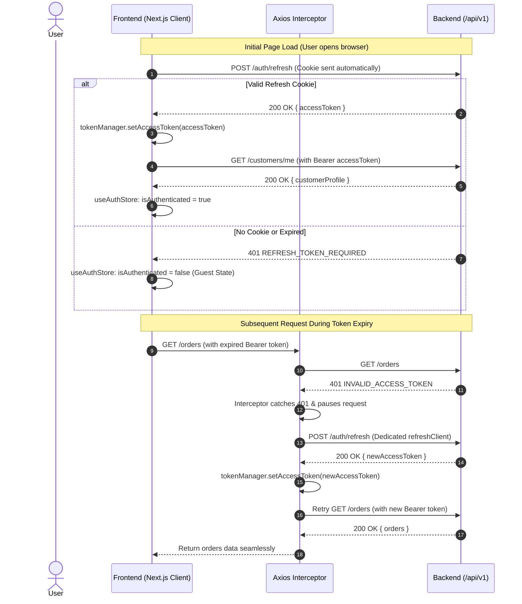

# Buybox Frontend API Integration Architecture

> **Authoritative Backend Contract:** [`frontend/docs/backend-api-contract.md`](./backend-api-contract.md)  
> **Authoritative Auth Flow:** [`frontend/docs/auth-flow.md`](./auth-flow.md)  
> **Implementation Scope:** Next.js 16 (App Router), React 19, Axios, Zustand.

---

## Table of Contents
1. [Architecture Overview](#1-architecture-overview)
2. [Axios Client Architecture](#2-axios-client-architecture)
3. [Authentication & Refresh Flow](#3-authentication--refresh-flow)
4. [API Error Normalization](#4-api-error-normalization)
5. [Guest Cart Architecture](#5-guest-cart-architecture)
6. [Service Layer Design](#6-service-layer-design)
7. [Zustand State Management](#7-zustand-state-management)
8. [Server Component vs Client Component API Usage](#8-server-component-vs-client-component-api-usage)
9. [Security Considerations](#9-security-considerations)
10. [Current Backend Limitations & Future Migration Paths](#10-current-backend-limitations--future-migration-paths)

---

## 1. Architecture Overview

The Buybox frontend API layer is engineered as a clean, decoupled integration pipeline that connects Next.js 16 (React 19) components to the existing Express + MongoDB backend.

```
┌────────────────────────────────────────────────────────┐
│             Next.js 16 Presentation Layer              │
│   (Server Components, Client Pages, UI Modals, Forms)  │
└───────────────┬────────────────────────┬───────────────┘
                │                        │
       (Client Hooks & State)    (Direct SSR Fetch)
                │                        │
┌───────────────▼──────────────┐         │
│     Zustand Stores           │         │
│ (useAuthStore, useCartStore) │         │
└───────────────┬──────────────┘         │
                │                        │
┌───────────────▼────────────────────────▼───────────────┐
│                 Domain Services Layer                  │
│ (authService, productService, cartService, etc.)       │
└───────────────┬────────────────────────────────────────┘
                │
┌───────────────▼────────────────────────────────────────┐
│            Axios Central HTTP Client                   │
│   - In-memory Access Token Injection                   │
│   - Refresh Queue Interceptor (Atomic 401 recovery)    │
│   - Normalized ApiError Transformer                    │
└───────────────┬────────────────────────────────────────┘
                │ (HTTP Requests via withCredentials: true)
┌───────────────▼────────────────────────────────────────┐
│             Buybox Express Backend API                 │
│              Base Mount: `/api/v1`                     │
└────────────────────────────────────────────────────────┘
```

---

## 2. Axios Client Architecture

All outgoing API traffic flows through a single configured Axios instance located at [`src/lib/api/axios.js`](../src/lib/api/axios.js).

### Key Characteristics:
1. **Dynamic Base URL:** Loaded from `process.env.NEXT_PUBLIC_API_URL` (defaulting to `http://localhost:5000/api/v1` in local dev).
2. **Cookie Credentials:** Configured with `withCredentials: true` so that the `refreshToken` `httpOnly` cookie scoped to `/api/v1/auth` is automatically attached by the browser on authentication requests.
3. **Dedicated Refresh Client:** A secondary `refreshClient` without response interceptors is dedicated strictly to `/auth/refresh` calls. This avoids interceptor recursion and guarantees that a failing refresh attempt does not cause an infinite loop.
4. **Transparent 401 Queueing:** If a request receives a 401 `INVALID_ACCESS_TOKEN`, the request is paused. If multiple requests fail with 401 concurrently, only **one** refresh request is dispatched. All other incoming requests are pushed to a `failedQueue` and replayed once the new token is acquired.

---

## 3. Authentication & Refresh Flow

Buybox employs a dual-token JWT architecture:
- **Short-Lived Access Token (15 Minutes):** Kept strictly **in memory** via [`src/lib/auth/token-manager.js`](../src/lib/auth/token-manager.js). Never persisted to `localStorage` or `sessionStorage` (preventing XSS credential theft).
- **Long-Lived Refresh Token (7 Days):** Sent by the backend in a hardened `Set-Cookie: refreshToken=<token>; HttpOnly; Path=/api/v1/auth; SameSite=Lax`.

### Automatic Silent Session Recovery (Lifecycle)



---

## 4. API Error Normalization

Backend errors adhere to `{ success: false, message: string, code: string, requestId?: string }`.

The frontend normalizes all error structures using the [`ApiError`](../src/lib/api/api-error.js) class:

```javascript
import { ApiError, normalizeApiError } from "@/lib/api/api-error";

try {
  await orderService.createOrder(payload);
} catch (error) {
  const err = normalizeApiError(error);
  console.error(err.message); // e.g. "Insufficient stock for SKU KB-MECH-BLK"
  console.error(err.code);    // e.g. "INSUFFICIENT_STOCK"
  console.error(err.status);  // e.g. 400
  console.error(err.details); // Validation or inventory breakdown
}
```

### Normalized Error Helpers:
- `err.isAuthError`: True for `401`, `AUTHENTICATION_REQUIRED`, `INVALID_ACCESS_TOKEN`.
- `err.isForbidden`: True for `403`, `INSUFFICIENT_ROLE`, `INSUFFICIENT_PERMISSIONS`.
- `err.isNotFound`: True for `404`, `NOT_FOUND`.
- `err.isValidationError`: True for `400` with `VALIDATION_ERROR`.
- `err.isNetworkError`: True for server offline or CORS failure (status `0`).

---

## 5. Guest Cart Architecture

### The Problem
The Buybox backend route `/api/v1/cart` is mounted behind `router.use(authenticate)`. There is **no backend guest cart endpoint**.

### The Frontend Solution
1. **Explicit Storage Separation:**
   - **Guest Cart:** Managed in Zustand with `zustand/middleware/persist` using key `buybox_guest_cart`. Saved to `localStorage`.
   - **Server Cart:** Managed in Zustand state `serverCart: null`, dynamically fetched via `GET /api/v1/cart`. **Never stored in localStorage**.
2. **Unified UI Consumption:**
   - The `useCart()` hook reads `useAuthStore.isAuthenticated`.
   - If authenticated, it displays `serverCart.items` and calls backend endpoints.
   - If guest, it displays `guestCart.items` and modifies local state.
3. **Login Migration Behavior:**
   - When a guest logs in, the store provides `migrateGuestCartToServer()`.
   - It iterates through each guest item and invokes `cartService.addItem({ productVariantId, quantity })`.
   - Successfully added items are safely cleared from local storage.
   - Failed items (e.g. out-of-stock items) remain in `guestCart` so that customer data is never silently dropped.

---

## 6. Service Layer Design

Domain services contain purely HTTP integration logic. They:
- Do **not** contain React or UI logic.
- Do **not** mutate Zustand stores directly.
- Map 1:1 with confirmed backend routes:

| Service Module | Backend Mount | Description |
|---|---|---|
| [`authService`](../src/services/auth.service.js) | `/api/v1/auth` | Login, register, refresh, logout, password reset, email verify |
| [`productService`](../src/services/product.service.js) | `/api/v1/products`, `/api/v1/product-variants` | Catalog queries, slug lookup, variant management |
| [`categoryService`](../src/services/category.service.js) | `/api/v1/categories` | Hierarchical taxonomy and category CRUD |
| [`brandService`](../src/services/brand.service.js) | `/api/v1/brands` | Brand catalog and CRUD |
| [`cartService`](../src/services/cart.service.js) | `/api/v1/cart` | Authenticated cart retrieval, item add/update/delete |
| [`wishlistService`](../src/services/wishlist.service.js) | `/api/v1/wishlist` | Authenticated wishlist items |
| [`addressService`](../src/services/address.service.js) | `/api/v1/addresses` | Customer shipping/billing address book |
| [`orderService`](../src/services/order.service.js) | `/api/v1/orders` | Checkout finalization, order history, cancellation |
| [`paymentService`](../src/services/payment.service.js) | `/api/v1/payments` | Razorpay payment intent creation and signature verification |
| [`reviewService`](../src/services/review.service.js) | `/api/v1/reviews` | Product reviews, ratings, helpful votes, moderation |
| [`customerService`](../src/services/customer.service.js) | `/api/v1/customers` | Customer profile and preferences |
| [`inventoryService`](../src/services/inventory.service.js) | `/api/v1/inventory` | Multi-warehouse inventory lookups and adjustments |
| [`couponService`](../src/services/coupon.service.js) | `/api/v1/coupons` | Checkout coupon validation and admin management |
| [`shipmentService`](../src/services/shipment.service.js) | `/api/v1/shipments` | Customer shipment tracking |
| [`cmsService`](../src/services/cms.service.js) | `/api/v1/cms/pages` | Published pages content and layout blocks |

---

## 7. Zustand Responsibilities

| Store | Scope & State Managed | Persistence |
|---|---|---|
| [`useAuthStore`](../src/stores/auth.store.js) | `user`, `customerProfile`, `isAuthenticated`, `isLoading`, `isInitialized`, `error` | In-memory. Synchronized with `tokenManager` and httpOnly cookie. |
| [`useCartStore`](../src/stores/cart.store.js) | `guestCart: { items }`, `serverCart`, `isMigrating` | `guestCart` is persisted in `localStorage`. `serverCart` is memory-only. |
| [`useWishlistStore`](../src/stores/wishlist.store.js) | `guestWishlist: { itemVariantIds }`, `serverWishlist` | `guestWishlist` is persisted in `localStorage`. `serverWishlist` is memory-only. |

---

## 8. Server Component vs Client Component API Usage

Next.js 16 App Router supports two distinct execution contexts:

### 1. Server Components (SSR / Static Generation)
- **Use Case:** Catalog browsing, SEO-critical product pages (`/product/[slug]`), category listings (`/category/[slug]`), CMS pages (`/pages/[slug]`).
- **How to Call:** Call domain services directly in Server Components (`async/await`):
  ```javascript
  // app/product/[slug]/page.jsx (Server Component)
  import { productService } from "@/services/product.service";

  export default async function ProductPage({ params }) {
    const { slug } = await params;
    const response = await productService.getProductBySlug(slug);
    const product = response.data.product;

    return <ProductDetailView product={product} />;
  }
  ```
- **Rule:** Do not invoke React hooks (`useCart`, `useAuth`) in Server Components.

### 2. Client Components (Interactive UI)
- **Use Case:** Cart drawer, checkout form, authentication modals, quantity toggles, address forms.
- **How to Call:** Use hooks (`useCart()`, `useAuth()`, `useWishlist()`):
  ```javascript
  "use client";

  import { useCart } from "@/hooks/useCart";

  export function AddToCartButton({ variantId }) {
    const { addItem, isLoading } = useCart();

    return (
      <button
        onClick={() => addItem({ productVariantId: variantId, quantity: 1 })}
        disabled={isLoading}
      >
        Add to Cart
      </button>
    );
  }
  ```

---

## 9. Security Considerations

1. **Zero Secret Leakage:**
   - No JWT secrets, DB credentials, Razorpay secret keys, or AWS keys exist in the frontend project.
   - Frontend only has access to `NEXT_PUBLIC_` variables.
2. **Protection Against XSS Token Theft:**
   - Access tokens are stored exclusively in memory. If malicious JavaScript executes, it cannot extract tokens from `localStorage`.
   - Refresh tokens are protected inside an `httpOnly` cookie that JavaScript cannot read.
3. **No Authoritative Frontend Calculations:**
   - Prices, discounts, taxes, and shipping rates calculated in the frontend are treated strictly as **cosmetic previews**.
   - The backend order service re-validates item prices, inventory quantities, tax rules, and coupon discounts authoritatively inside a MongoDB transaction.
4. **Backend RBAC Authority:**
   - Frontend route guards and conditional rendering are strictly for User Experience (UX), never security. The backend verifies permissions on every request.

---

## 10. Current Backend Limitations & Future Migration Paths

During the backend API audit, the following limitations were verified:

1. **No Guest Cart Backend Support:**
   - `/api/v1/cart` requires JWT authentication.
   - *Current Solution:* Frontend maintains guest cart in `localStorage`.
   - *Recommended Backend Change:* Provide a session-based or guest-token cart endpoint, or a dedicated `POST /api/v1/cart/merge` endpoint that accepts an array of `{ productVariantId, quantity }` to merge atomically.
2. **No Dedicated Cart Merge Endpoint:**
   - *Current Solution:* `useCartStore.migrateGuestCartToServer()` sequentially iterates items.
3. **No Multipart Form File Upload Endpoint:**
   - `/api/v1/storefront/media` only stores asset URLs; there is no `multer` endpoint.
   - *Current Solution:* Client must upload directly to S3 / Cloudinary using presigned URLs or frontend widget, then register the URL with the backend.
4. **No Notification REST Endpoints:**
   - Notifications exist only as internal BullMQ worker events sending emails via ElasticEmail.
   - *Current Solution:* Storefront notification popups or bells must remain static until backend notification endpoints (`GET /notifications`) are implemented.
5. **No Google OAuth / Phone OTP Endpoints:**
   - Authentication is strictly email + password with email verification tokens.
